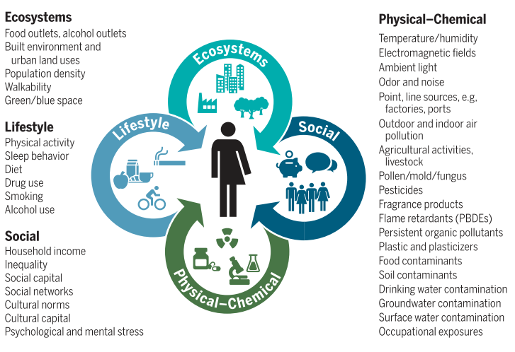
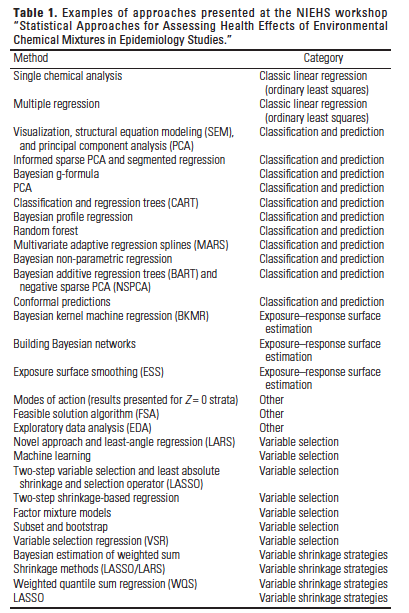

# Introduction

## The Exposome

A major goal of public health research is the study of the complex mechanisms leading to the development of diseases in humans, and the identification of potentially modifiable risk factors that could be targeted to reduce the burden of diseases in the overall population or in specific subgroups at high risk. A considerable number of potentially modifiable risk factors have been thoroughly studied, including dietary constituents, environmental factors such as chemicals and pollutants, lifestyle, social, and other ecological factors. Nevertheless, throughout their lifetime, humans are exposed to hundreds of these factors, which jointly contribute to the development of a given disease with complex mechanisms that can also involve antagonistic or synergistic interactions. This complex set of exposure is commonly referred to as "exposome" [@vermeulen2020exposome].




Even restricting our interest to environmental exposures, a substantial component of the exposome, it is recognized that we are simultaneously exposed to hundreds of chemicals and pollutants, and it has been shown that a given blood or urine sample taken from a random American will contain some concentration of at least 400 different chemicals. A group of 3 or more chemicals/pollutants, simultaneously present in nature or in the human body, is commonly defined as an environmental mixture. 

## Why focusing on multiple exposures?

Common approaches that have been used on a daily basis in environmental epidemiology might fail to capture the complexity of exposures in our world. For several years, despite recognizing that individuals are commonly exposed to multiple environmental factors, the "one-at-the-time" approach has remained the standard practice in most epidemiological research. To better understand  what we mean by "one-at-the-time" approach, and its limitations, let's think of a study where we want to evaluate the effects of parabens - endocrine disrupting chemicals commonly used in the production of personal care products and cosmetics - on diabetes in a population of 1000 individuals. Let's assume that through urine samples analysis we were able to detect concentrations of three common parabens compounds (metylparaben, butylparaben, propylparaben) in most of our individuals. The "one-at-the-time" approach would build 3 independent statistical models (these could even be very sophisticated models that account for any level of data complexity), one for each parabens compound, adjusting for potential confounders of the associations but without taking into account the other 2 detected compounds. When this approach is chosen we encounter three main limitations:

* We know that individuals are exposed to multiple factors, and we might want to estimate the joint (also knows as cumulative) effects of these chemicals. A "one-at-the-time" approach does not allow responding to this question.

* Is there any interaction between the three compounds in predicting diabetes? A "one-at-the-time" approach does not allow responding to this question.

* Last but not least, this approach is making strong assumptions with regards to the causal structure underlying the data. Specifically, we are assuming that, very unrealistically, the association between each compound and the outcome is not confounded by the presence of any of the other compounds.

To overcome these 3 major limitations we need to evaluate exposure to parabens as a mixture of the three evaluated compounds, building a single statistical model that could jointly evaluate the three exposures and possibly accounting for co-confounding, interactions, and other specific features of the data. Obtaining such statistical model is not easy, and things would only get more complex if we wanted to account for a larger mixture of chemicals, or even to incorporate several groups of exposures in an exposome-wide analysis. Over the last decade or so, many researchers have focused their effort on developing statistical approaches for environmental mixtures, adapting techniques from other fields or developing new methodologies from scratch. The National Institute of Environmental Health Sciences (NIEHS) launched a specific initiative, called Powering Research Through Innovative Methods for Mixtures in Epidemiology (PRIME), to encourage methods developments in this direction, and organized workshops and symposiums on the topics. An important symposium in 2015 identified several available approaches and discussed advantages and limitations for each [@taylor2016statistical]. 



Five years later the number of available approaches has multiplied, and several of the discussed methodologies has been extended, revised, and presented to the public. The field of environmental epidemiology is gradually moving to a multi-pollutants or multi-chemical framework as a default [@dominici2010protecting], leading the ground in exposome research, and more and more papers are published within this topic. 

The goal of this class is to present and discuss some of these approaches, presenting their advantages and limitations and, most importantly, discussing what research question they target and when they should be chosen to evaluate environmental mixtures. While it is impossible to cover all available techniques, we will provide a set of references for alternative methodologies that are not discussed here. Finally, most of the examples and discussion will focus on environmental exposures. It comes without saying that extension of these approaches into other fields of exposome research (e.g. evaluating multiple nutrients, multiple lifestyle factors \dots) is recommended and would provide enormous benefits.

## What is your research question?

When evaluating a set of environmental factors detected in a given population as an environmental mixture, a critical step is the identification of the research question of interest. The discussion of the different methodologies presented in the aforementioned NIEHS workshop concluded that we do not have an optimal approach, but that each method performed well under a specific research question. Here are some of the most common questions that we may want to address:

1. Do we have recurrent patterns of exposures?

With several factors at play, it is often of interest to understand whether specific components of the mixture are clustered into smaller subgroups, based on similar characteristics, shared sources, or other features.

2. What is the overall effect of the mixture on a given outcome?

From our previous example, we may be interested in evaluating the overall effects of parabens exposure on the risk of diabetes. We are not really interested in the specific role of each compound but only on the cumulative effect of the several components.

3. Who are the bad actors? What are the individual effects within the mixture?

Let's assume that we have identified a potentially harmful effect of our mixture on the outcome of interest, and therefore we want to reduce the levels of exposures in our population. If question 1 has identified common patterns due to shared sources, we could simply target these sources, disregarding the actual effects of these chemicals. Alternatively, we could try to identify which component of the mixture is responsible for the effect observed in question 2. In our parabens example, if we had observed a positive association we may want to further investigate whether it is MP, PP, BP, or more than one of them, driving the association between the mixture and the outcome. 

4. Is there any interaction between chemicals in predicting the outcome?

When more than one mixture component contributes to a given mixture-outcome association, it is reasonable to expect that some kind of interaction between the 2 will be present. 

In general, one might have one or more research questions in mind, or simply want to evaluate the mixture in an exploratory way. No matter what, it will always be recommended to explore different techniques and thoroughly compare and validate results.  

## Broad classification(s) of statistical approaches

Over the last few years several papers have reviewed the existing literature on statistical methods for mixtures and provide different criteria for their classifications [@hamra2018environmental], [@stafoggia2017statistical]. Simple and relevant classification criteria are the following: 

1. Supervised vs unsupervised procedures

This first distinction refers to whether or not the mixture is evaluated by taking into account its association with a given outcome of interest. We will see in Section 2 that, before evaluating the effects of our exposures on health outcomes, it is important to carefully assess the structure of the mixture, especially when this is composed by several components, investigating its correlations structure and identifying the presence of subgroups or clusters of exposures. To this end, unsupervised techniques directly focus on characterizing the complex mixture of exposures without any reference to a given outcome of interest. Supervised techniques, on the other hand, attempt to account for the complex nature of exposures while investigating a given mixture-outcome association.

2. Data reduction vs variable selection techniques. 

The goal of all techniques we will cover is to reduce the complexity of the data to be able to assess mixtures-outcome associations, while maintaining as much information as possible. This is broadly done in two way: by summarizing the original exposures into fewer and easier to deal with covariates, or by selecting targeted elements of the mixture. We can use the term "data reduction approaches" to describe those techniques that reduce the dimension of the mixture by generating new variables (scores, components, indexes \dots). On the other hand, "variable selection approaches" are those that select specific elements of the mixture that are directly evaluated with respect to the outcome. 


## Introduction to R and the simulated data

All methods that we will present can be used in the R statistical software. An introduction to R, for those unfamiliar with the software, can be found here: https://rpubs.com/alecri/intro-epiR. R is a free statistical software environment that allows you to write your own code and packages, sharing them as open sources. For this reason, it is common that any newly developed statistical method will first be implemented in R. As such, several recently developed approaches for environmental mixtures are only available in R. Most R packages are accompanied by online tutorials and vignettes that describe all features of the library and provide illustrative examples and explanations. We refer to those documents for the technical information of the R packages, and only focus here on methods implementation and results interpretation. The following packages will be used:

```{r setup, include=FALSE}
knitr::opts_chunk$set(fig.pos = 'H', echo = TRUE)
knitr::opts_chunk$set(message = FALSE)
knitr::opts_chunk$set(warning = FALSE)
```

```{r, results=FALSE}
Packages <- c("readxl", "bkmr", "qgraph", "gWQS", "qgcomp", "corrplot", "cluster","factoextra","gridExtra","table1","glmnet")
lapply(Packages, library, character.only = TRUE)
```


As an illustrative example we will use a simulated dataset that was developed for the 2015 NIEHS workshop previously mentioned and made publicly available. The dataset is available here (under Data Set #2 https://www.niehs.nih.gov/news/events/pastmtg/2015/statistical/index.cfm)  and a description of the data structure is also provided. Specifically, the data includes a mixture of 14 continuous exposures, ($X_1-X_{14}$), a continuous outcome $Y$, and 3 additional covariates ($Z_1-Z_3$).

```{r, include=FALSE}
data2<- read_excel("C:/Users/AI880/Dropbox/Teaching/Environmental mixtures/2021_EH550/labs/dataset2xls.xls")
#data2 <- read_excel("~/Dropbox/Teaching/Environmental Mixtures/2021_EH550/labs/dataset2xls.xls")
```

```{r, echo=FALSE}
knitr::kable(
  head(data2),
  caption = 'First rows of the dataset'
)
```

By actually knowing the actual associations we will be able to evaluate how well each method performs with respect to the several research questions of interest. Specifically, chemical concentrations were generated based on the correlation between log-transformed PCBs, dioxins, and furans, from NHANES data. Two clusters of highly-correlated covariates were present ($X_3-X_4-X_5$, and $X_{12}- X_{13}$, while low to moderate correlations were simulated between other covariates. $Z_1$ and $Z_2$ were simulated based on poverty index and age, both assumed to be confounders of the association. $Z_3$ was simulated based on gender distribution, and assumed to be an effect modifier. The outcome was generated with the following functions for male and female, respectively:

$$Z_3=0: E[Y]=3 + 0.05*X_4 + 0.1*X_6 + 0.1*X_{11} + 0.5*X_{12} + 0.1*X_{14} + 0.01*Z_1 + 0.003*Z_2  $$
$$Z_3=1: E[Y]=3 + 0.01*X_1 + 0.05*X_4 + 0.1*X_{11} + 0.1*X_{14} + 0.01*Z_1 + 0.003*Z_2 – 0.32*(Z_3=1) $$

Thus, for $Z_3=0$ only $X_4, X_6, X_{11}, X_{12}$ and $X_{14}$ are positively associated with $Y$. When $Z_3=1$, only $X_1, X_4, X_{11}$ and $X_{14}$ are associated with $Y$. Interactions between chemicals were not considered.

