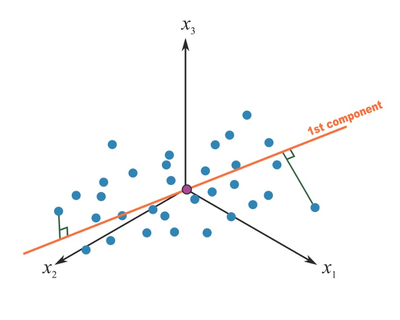
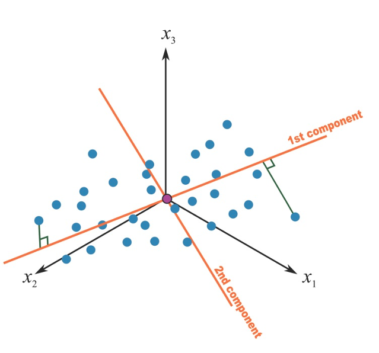
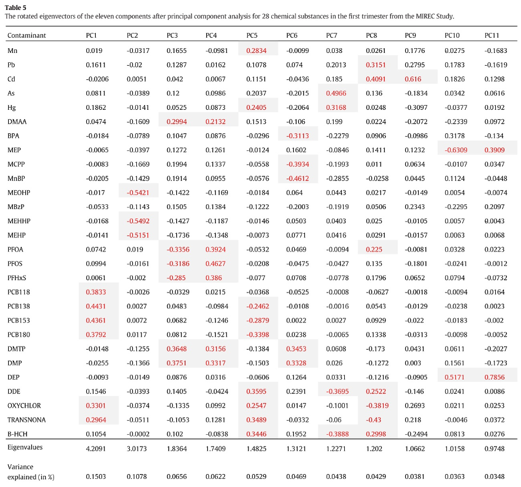
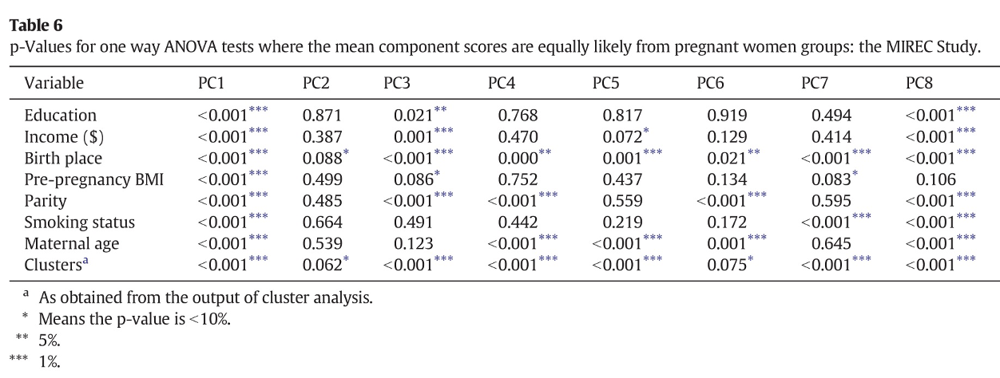
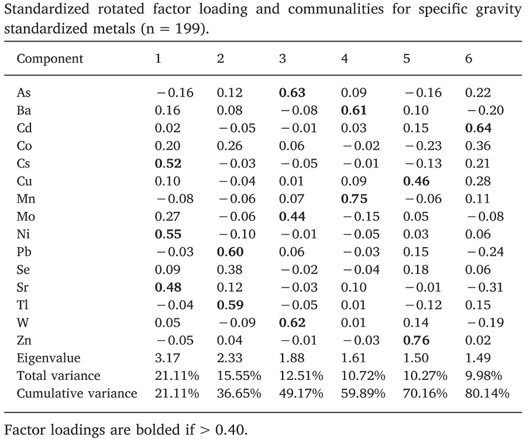

# Unsupervised analysis

As introduced in the previous section, the term unsupervised analysis refers to that critical part of the analytic phase where we only focus on the exposures, trying to characterize, explain, and describe the complex environmental mixture of interest. This could even be the ultimate goal of the analysis (as a matter of fact, to respond to common questions such as "what are the most common exposures in our populations?" or "can we identify subgroups of exposures that are often found together?" we do not to account for the outcome. In other setting, this will be an important part that will inform subsequent analytic steps. 

Note that here the focus is not on understanding biological mechanisms through which chemicals or pollutants operate in the body. The focus on unsupervised analysis in this context is, instead, a descriptive and epidemiologic one. When we are attempting to identify clusters of exposures without accounting the their relationship with a given outcome, the grouping will be based on aspects such as population distribution and shared sources rather than on similar mechanisms of action. 


## Pre-processing 

Before getting into the actual analysis of the mixture it is important to carefully assess each component independently. Environmental exposures such as chemicals or pollutants, but also indicators of greenness, noise, or temperature, share important characteristics that complicate their statistical evaluation.

* Skewedness and variance. Exposures are often non-negative and heavily skewed on the right due to the presence of outliers and to the fact that they are strictly non-negative. For this reason, it is usually recommended to log-transform these exposures. Nevertheless, when such operation is taken into account, researchers have to deal with decisions on how to treat eventual zero-values that do not necessarily represent missing data. 

* Centering and standardizing exposures. Mixture components tend to have different and difficult to compare measurements and variability, even within the same family of exposures. Since these exposures will be eventually evaluated together, centering and standardizing the covariates will allow comparability and better interpretation of statistical findings. 

* Zero values. It is relatively common, when evaluating large mixtures of environmental exposures, to encounter one or more covariates with a considerable amount of values equal to 0. How to deal with such zero-values will have important consequences on the implementation and interpretation of statistical approaches for mixtures. The first question to consider is what these zero values represent: specifically, are they "real zeros" (i.e. the individuals had no exposure to a given chemical), or do they represent non-detected values (i.e. the individual had a low level of exposure that we were not able to detect)? In the first case, the values will have to be treated as an actual zero, with important implications for the analysis (we will briefly deal with this when talking about zero-inflated covariates in Section 6). In the second case, non-detected values are usually imputed to a predefined value (several approaches are available) and the covariate can be treated as continuous. 

* Missing values. Finally, it is important to evaluate the percentage of missing values for each exposure in our mixture. Most techniques that allow evaluating the joint effect of several covariates, including regresison models, will require a complete-case analysis. As such, an individual with just one missing values in one of the several mixture components, will be excluded from the whole analyses. If the proportion of missingness is not too high (10-15%), multiple imputation techniques can be used, even though the user should be aware that most advanced methodologies might not be fully integrated withing a multiple implementation procedure. If the percentage of missingness is too high, there is not too much to be done, and we will have to decide whether to give up the covariate (excluding it from the mixture), or reduce the sample size (excluding all individual with missing values on that component)

The dataset we are using in our illustrative example includes simulated covariates where this pre-processing steps have been done ( all values are greater than 0, no missing data are present, covariates are log-transofmred and standardized). 

```{r, include=FALSE}
Packages <- c("readxl", "bkmr", "qgraph", "gWQS", "qgcomp", "corrplot", "cluster","factoextra","gridExtra","table1")
lapply(Packages, library, character.only = TRUE)
data2 <- read_excel("C:/Users/AI880/Dropbox/Teaching/Environmental mixtures/2021_EH550/labs/dataset2xls.xls")
# <- read_excel("~/Dropbox/Teaching/Environmental Mixtures/2021_EH550/labs/dataset2xls.xls")
```

```{r figure1, fig.cap='Histogram of first 3 components', out.width='80%', fig.asp=.75, fig.align='center', echo=FALSE}
par("mfcol"=c(1, 3))
hist(data2$x1, col="red")
hist(data2$x2, col="blue")
hist(data2$x3, col="green")
```

To conduct a thorough exploratory analysis of environmental mixtures, especially when several covariates are of interest, we encourage the use of the R package `rexposome` , fully described [here](https://www.bioconductor.org/packages/release/bioc/vignettes/rexposome/inst/doc/exposome_data_analysis.html#multivariate-exposome-analysis)


## Correlation analysis

An essential step when evaluating an environmental mixture is the assessment of the correlation between the mixture components. This preliminary analysis gives a sense of the relationship between exposures, allows a preliminary assessment of exposures patterns and clusters, and gives important information that will suggest which method could be better suited for future modeling. 

Given 2 continuous covariates, a simple assessment of their relationship can be checked with a simple two-ways scatterplots. Here we show a set of three 2x2 comparison, also adding a lowess trend line on top of the scatter plot. 

```{r figure2, fig.cap='Scatter plots', out.width='80%', fig.asp=.75, fig.align='center', echo=FALSE}
par("mfcol"=c(1, 3))
plot(data2$x3, data2$x5, main = "",
     xlab = "X5", ylab = "X3")
lines(lowess(data2$x3, data2$x5), col = "blue")

plot(data2$x1, data2$x5, main = "",
     xlab = "X5", ylab = "X1")
lines(lowess(data2$x1, data2$x5), col = "blue")

plot(data2$x13, data2$x12, main = "",
     xlab = "X12", ylab = "X13")
lines(lowess(data2$x13, data2$x12), col = "blue")
```

We see some combinations of covariates being highly correlated (like $X_3$ and $X_4$), while other exposures seem to be completely independent (e.g. $X_1$ and $X_5$).

A correlation coefficient and a correlation test, will additionally provide a quantitative measure of this relationship. The Pearson correlation ($r$) measures  the linear dependence between two variables and it can only be used when both covariates are normally distributed

$$r=\frac{\sum(x-m_x)(y-m_y)}{\sqrt{\sum(x-m_x)^2(y-m_y)^2}}$$

where $m_x$ and $m_y$ are the means of the two covariates $x$ and $y$

The Spearman correlation ($\rho$) measure computes the correlation between the rank of the two covariates $x$ and $y$ 

$$\rho=\frac{\sum(x'-m_{x'})(y'-m_{y'})}{\sqrt{\sum(x'-m_{x'})^2(y'-m_{y'})^2}}$$


where $m_{x'}$ and $m_{y'}$ are the ranks of $x$ and $y$. This correlation test is non-parametric and does not require assuming normality for the two evaluated covariates. 

Both $r$ and $\rho$ are bounded between -1 and 1 (negative and positive correlation). There is no correlation between the covariates when the coefficient is equal to 0. Tests for significance of the correlation coefficient are available for both $r$ and $\rho$, testing the null hypothesis of no correlation

Here we calculate the correlation coefficients, and test, for some pair of exposures in our mixture:
```{r}
r15 <- cor.test(data2$x1, data2$x5, method = "pearson")
r15

rho15 <- cor.test(data2$x1, data2$x5, method = "spearman")
rho15

r1213 <- cor.test(data2$x12, data2$x13, method = "pearson")
r1213

rho1213 <- cor.test(data2$x12, data2$x13, method = "spearman")
rho1213
```

When evaluating the correlation between several exposures we can create a correlation matrix


```{r, tidy=FALSE}
#Correlation matrix
cor.matrix <- cor (data2[,3:16], method = "spearman")
knitr::kable(
  cor.matrix, booktabs = TRUE,
  caption = 'Correlation matrix'
)
```

While informative, this is not a really nice way of presenting results, and we prefer to use graphical tools such as the Correlation plot (or, correlogram) This is done by using the package `corrplot`. Note that the command requires you use the correlation matrix you previously defined.


```{r figure, fig.cap='Correlation Plot', out.width='80%', fig.asp=.75, fig.align='center'}
corrplot(cor.matrix,
         method="circle",
         order = "hclust",
         addrect =10,
         tl.pos = "l",
         tl.col = "black",
         sig.level = 0.05)
```
 [This](https://cran.r-project.org/web/packages/corrplot/vignettes/corrplot-intro.html) link provides a very useful description of the several `corrplot` options. 


The correlation plot in the example provides several important information: first of all, we see a cluster of highly correlated exposures ($X_3$,$X_4$,$X_5$), and a cluster of moderately correlated exposures ($X_{12}$, $X_{13}$). In addition, we observe that low to moderate levels of correlation also exist between most pairs of exposures, and it is not straightforward to identify clearly define additional subgroups of exposures. 

## Weighted correlation network analysis

Network analysis is emerging as a flexible and powerful technique in different fields. In a nutshell, a network refers to a complex structure of variables, called nodes, and the relationships (formally called edges) between these nodes. Correlation networks define such relationships on the basis of their quantitative correlations, and are increasingly being used in biology to analyze high-dimensional data sets. Weighted correlation networks, in particular, preserve the continuous nature of the underlying correlation information without dicothomizing information. While the theory behind network analysis is beyond the scope of this course, and we refer to other publications for further details (@langfelder2008wgcna), (@hevey2018network), it is here useful to mention that these networks can be  used in descriptive analyses to graphically display the relationship between exposures in our mixture based on the correlation structure. This can be now obtained with several R packages, including `qgraph`, documented [here](http://sachaepskamp.com/files/Cookbook.html#pearson-correlations). 


```{r figure3, fig.cap='Weighted correlation network', out.width='80%', fig.asp=.75, fig.align='center', echo=FALSE}
qgraph(cor.matrix, graph = "pcor", layout = "spring")

```
This network confirms our finding from the correlation plot, but provides a different and possibly better way of representing and visualizing the relationships between components of the mixture. 

## Principal component analysis

Principal Component Analysis (PCA) is a useful technique for exploratory data analysis, which allows a better visualization of the variability present in a dataset with many variables. This "better visualization" is achieved by transforming a set of covariates into a smaller set of Principal Components. 

A principal component can be thought of as the direction where there is the most variance or, geometrically speaking, where the data is most spread out. In practical terms, to derive the first principal component that describe our mixture, we try to find the straight line that best spreads the data out when it is projected along it, thus explaining the most substantial variance in the data. The following Figure shows the first principal component in a simple setting with only 3 covariates of interest (so that we could graphically represent it):



Mathematically speaking, this first component $t_1$ is calculated as a linear combination of the $p$ original predictors $T=XW_p$, where $W_p$ are weights that would maximize the overall explained variability. For those math-oriented readers, it turns out that such weights are the eigenvectors of the correlation matrix of the original exposures.  

Once a first component has been retrieved, we proceed by calculating a second component that would maximize the residual variance. Of interest in our context, the procedure adds a constraints of orthogonality to this second component, that is, it will be uncorrelated to the first one, as presented in the figure. 



Mathematically, this is obtained by another linear combination where the weights are the eigenvectors corresponding to the second largest eigenvalue. In this way we can proceed to derive a full set of $p$ components from our original $p$ covariates, until all variance has been explained. In summary, PCA is a set of linear transformation that fits the matrix of exposures into a new coordinate system so that the most variance is explained by the first coordinate, and each subsequent coordinate is orthogonal to the last and has a lesser variance. You transform a set of $p$ correlated variables into a set of $p$ uncorrelated principal components. PCA is sensitive to unscaled covariates, so it is usually recommended to standardize your matrix of exposures before running a PCA analysis. 

### Fitting a PCA in R

There are several options to conduct PCA in R. Here we will use `prcomp` but alternative options are available (`princomp` and `principal`). PCA is also available in the aforementioned `rexposome` package. If you want to prepare nice figures for presentations or usage in manuscripts, I also recommend taking a look a the `factoextra` package to create a ggplot2-based elegant visualization ([link](http://www.sthda.com/english/wiki/factoextra-r-package-easy-multivariate-data-analyses-and-elegant-visualization)). 


```{r, include=FALSE }
# load required packages
library(readxl)
library(dplyr)   
set.seed(123)   
#data2 <- read_excel("~/Dropbox/Teaching/Environmental Mixtures/2021_EH550/labs/dataset2xls.xls")
data2<- read_excel("C:/Users/AI880/Dropbox/Teaching/Environmental mixtures/2021_EH550/labs/dataset2xls.xls")


# define exposures and outcome
X<-as.matrix(data2[,3:16])
Y<-data2$y

```

The `prcomp( )` function produces a basic principal component analysis. The command requires the raw data you want to reduce (the exposure matrix) and will extract principal components. Here we are also centering and scaling all exposures. Table 2.2. shows the first rows of the newly derived variables (the components).

```{r pca}
fit <- prcomp(X, center=TRUE, scale=TRUE)

```

```{r, echo=FALSE}
knitr::kable(
  head(fit$x), 
  caption = 'First rows of the components'
)
```

### Choosing the number of components 

One of the most interesting features of PCA is that, while it is possible to calculate $p$ components from a set of $p$ covariates, we usually need a smaller nummber to successfully describe most of the variance of the original matrix of exposures. In practical terms, not only we are reshaping the original set of exposures into uncorrelated principal components, but we are also able to reduce the dimension of the original matrix into a smaller number of variables that describe the mixture. How many components do we actually need? Before getting to describe the several tools that can guide us on this decision, it is important to stress that this step will be purely subjective. Sometimes these tools will lead to the same evident conclusion, but other times it might not be straightforward to identify a clear number of components to describe the original data. In general, the three common tools used to select a number of components include:

* Select components that explain at least 70 to 80\% of the original variance
* Select components corresponding to eigenvalues larger than 1
* Look at the point of inflation of the scree plot

Let's take a look at these approaches in our illustrative example. These are the results of the PCA that we ran with the previous R command:

```{r pca_results}
summary(fit)
```

(Square roots of) eigenvalues are reported in the first line, while the second and third line present, respectively, the proportion of variance explained by each given component (note that, as expected, this decreases as we proceed with the estimation), and the cumulative variance explained. 

The scree plot is the plot of the descending eigenvalues. Ideally we would like to identify a point of inflation (also known as "elbow" of the curve), signifying that after a certain number of components, the proportion of variance that is additionally explained becomes minimal.

```{r screeplot, fig.cap='Scree plot'}
plot(fit,type="lines")
```

All these techniques seem to indicate that 3 components might successfully describe the original set of 14 exposures. 

### Getting sense of components interpretation

A PCA is made by three steps. Fitting the model is the easiest part as it only requires a line of coding (assuming that the pre-processing has been carefully conducted). The second step, selecting the number of components, requires some levels of subjectivity but is also relatively simple in most settings. The third step is usually the more complicated ones, as we are now tasked with providing some interpretation to the set of principal components that we have selected. To get a sense of what principal components represent, we usually look at loading factors, the correlation coefficients between the derived components and the original covariates. In practical terms they inform us on how much of the original variance of each covariate is explained by each component. Here are the loading factors for our example: 


```{r, tidy=FALSE}
#Correlation matrix
knitr::kable(
  fit$rotation, booktabs = TRUE,
  caption = 'Loading factors'
)
```

It is not simple to identify any clear pattern. Loading factors are generally low, and several covariates seem to equally load to more components. However, there is a trick that can be tried out to improve the interpretation of the components, consisting in rotating the axes. The most common approach to do that is called "varimax". Let's take a look  at the rotated loading factors for the first three components (the ones that we have selected) in our example:


```{r rotate_3}
rawLoadings_3<- fit$rotation[,1:3]
rotatedLoadings_3 <- varimax(rawLoadings_3)$loadings
rotatedLoadings_3
```

Interpretation remains a bit tricky and very subjective, but definitely improves. With 3 rotated components we observe covariates groupings that recall what we observed in the network analysis: we have $X_1, X_2$ with higher loadings on PC3, $X_7, X_9, X_{12}, X_{13}$ loading on PC2, and all others on PC1

### Using principal components in subsequent analyses
We have here described PCA as an unsupervised technique for describing the mixture. Principal components, however, can be used in further analysis, for example including the selected components into a regression model instead of the original exposures. This approach is very appealing in the context of environmental mixtures as it would result into incorporating most of the information of out exposure matrix into a regression models by using uncorrelated covariates, thus overcoming one of the major limitations of using multiple regression in this context (see Section 3). Nevertheless, the validity of this approach is strictly dependent on whether a good interpretation of the components has been determined; in our example we would not conclude that the PCA clearly summarizes exposures into well defined groups, and we would get negligible advantages by including such components into a regression model. The next subsection will present some published papers that applied this technique in environmental epidemiology. Furthermore, if subgroups of exposures are clearly identified from a PCA, this information can be incorporated into subsequent modeling technique such as BKMR or hierarchical modeling. 

### PCA in practice

Despite several techniques developed ad-hoc for the analysis of environmental mixtures have emerged, PCA remains a very common choice among environmental epidemiologists. Most of the times, the method is used to reduce the dimension of a mixture of correlated exposures into a subset of uncorrelated components that are later included in regression analysis. 

As a first example, let's consider a paper by @lee2017identification evalauting the association between pregnancy exposure to 28 contaminants (metals, pesticides, PCBs, phthalates, PFAS, BPA) and socio-economic status in the MIREC study.To summarize the mixture, the Authors conduct a PCA that suggests selecting 11 principal components. The following figure presents the loading factors, as included in the paper:



The interpretation of such components is not straightforward (the paper does not mention whether a rotation was considered). The first component has higher loadings on PCBs, while the second component has high loadings on DEHP metabolites. All other components have high loadings on specific subsets of exposures, but fail to uniquely identify clusters of exposures within the mixture. For example, to describe exposure to organochlorine pesticides, we find similar loading factors in PC1, PC5, and PC9. Similarly, organophosphate pesticides equivalently load on PC3, PC4, and PC6. As described in the previous paragraphs, this has relevant implications when attempting to evaluate PCA components in a regression model. The following figure presents results from such regression in the paper:



From this table we might be able to conclude that PCBs are associated with the outcome of interest (as they load on PC1), but it is not easy to draw any conclusion about other sets of exposures, whose variability is captured by multiple components. To conclude, the real information that a PCA model is giving us in this example is that the mixture is very complex and we do not observe clearly defined subgroups of exposures based on the correlation structure. In such setting, a PCA analysis might not be the best option to evaluate exposure-outcome associations, and other methods should be considered.

A second interesting example can be found in @sanchez2018urinary, evaluating metals and socio-demographic characteristics in the HEALS study in Bangladesh. Out of a mixture of 15 metals, a rotated PCA identified 6 principal components explaining 81\% of the total variability. Differently from the previous examples, such components better identify subgroups of exposures (figure).



If we look at these loading factors by row, we see that each metal has a high loading factor with one component, and low loadings to all other. For example arsenic (row 1) is described by PC3, cadmium (row 3), by PC6, and so on down to zinc, described by PC5.
In this situation, a regression model with the principal components will have a better interpretation; for example, associations between PC3 and the outcome can be used to retrieve information on the associations between arsenic, molybdenum, and tungsten, on the outcome.

Nevertheless, it is important to note some critical limitations of this approach, that remain valid also when a perfect interpretation can be provided. Let's think of this third principal component that is well describing the variability of arsenic, molybdenum, and tungsten. A regression coefficient linking PC3 with the outcome would only tell us how the subgroup of these 3 exposures is associated with the outcome, but would not inform us on which if the three is driving the association, whether all three exposures have effects in the same direction, nor whether there is any interaction between the three components. Moreover, let's not forget that components are calculated as linear combinations of the exposures and without taking the relationship with the outcome into account.

For these reasons, we can conclude that PCA is very powerful tool to be considered in the preliminary unsupervised assessment of the mixture as it can inform subsequent analyses. On the other hand, using derived components into regression modeling must be done with caution, and is usually outperformed by most supervised approaches that we will describe later. 

Finally, it is important to mention that several extensions of the classical PCA have been developed, including a supervised version of the approach. These techniques, however, were developed in other fields and have not gained too much popularity in the context of environmental exposures, where alternative supervised approaches, presented in the following sections, are generally used. 

## Cluster analysis

While a principal components analysis can be seen as a way to identify subgroups of exposures (the columns of the mixture matrix) within the mixture based on their correlation structure, another useful exploratory analysis consists in identifying subgroups of individuals (the rows of the data) that share similar exposure profiles. This is commonly done with cluster analysis. Like PCA, cluster analysis requires complete data and standardized variables. To group individuals, a distance measure must be identified, with several options available from standard euclidean distance to distances based on the correlations structure.

### K-means clustering

The most common approach to partition the data into clusters, is an unsupervised approach called k-means clustering. This method classifies objects in $k$ groups (i.e., clusters), so that individuals within the same cluster are as similar as possible, while individuals from different clusters are as dissimilar as possible. To achieve that, clusters are defined in a way that minimizes within-cluster variation. A simple algorithm for k-clustering proceeds as follow

1. Pre-specify $k$, the number of clusters
2. Select $k$ random individuals as center for each cluster and define the centroids, vectors of length $p$ that contain the means of all variables for the observation in the cluster. In our context, the $p$ variables are the components of our mixture of interest
3. Define a distance measure. The standard choice is the euclidean distance defined as $(x_i-\mu_k)$ i, for each individual in the study ($x_i$) and each cluster center ($\mu_k$). 
4. Assign each individual to the closest centroid
5. For each of the $k$ clusters update the cluster centroid by calculating the new mean values of all the data points in the cluster
6. Iteratively update the previous 2 steps until the the cluster assignments stop changing or the maximum number of iterations is reached. By default, the R software uses 10 as the default value for the maximum number of iterations.

This simple algorithm minimizes the total within-cluster variation, defined for each cluster $C_k$ as the sum of squared euclidean distances within that cluster $W(C_k)=\sum_{x_i\in C_k}(x_i-\mu_k)^2$

Since k-mean clustering requires the user to specify the number of groups, it is important to assess the optimal number of groups. A simple technique is to use the elbow method, similar to the one presented for PCA, which consists in plotting the within-cluster sum of squares versus the number of clusters, and locating the bend in the plot.

### K-means in R

We can compute k-means in R with the `kmeans` function within the `cluster` package. Here we are selecting 3 groups, also using the `nstart` option that will attempts multiple initial configurations (here 20) and report the best one.

```{r cluster, results=FALSE}
k3 <- kmeans(X, centers = 3, nstart = 20)
k3
```

The option `fviz_cluster` provides a nice graphical representation of the groupings. If there are more than two variables `fviz_cluster` will perform principal component analysis (PCA) and plot the data points according to the first two principal components that explain the majority of the variance.

```{r figurecl, fig.cap='Cluster analysis with 3 groups', out.width='80%', fig.asp=.75, fig.align='center'}
fviz_cluster(k3, data = X)
```

Here we can test more
```{r more}
k2 <- kmeans(X, centers = 2, nstart = 20)
k4 <- kmeans(X, centers = 4, nstart = 20)
k5 <- kmeans(X, centers = 5, nstart = 20)
```
```{r figurecl2, fig.cap='Cluster analysis with 2-5 groups', out.width='80%', fig.asp=.75, fig.align='center'}
p1 <- fviz_cluster(k2, geom = "point", data = X) + ggtitle("k = 2")
p2 <- fviz_cluster(k3, geom = "point",  data = X) + ggtitle("k = 3")
p3 <- fviz_cluster(k4, geom = "point",  data = X) + ggtitle("k = 4")
p4 <- fviz_cluster(k5, geom = "point",  data = X) + ggtitle("k = 5")

grid.arrange(p1, p2, p3, p4, nrow = 2)
```

The elbow plot can tell us how many groups optimally classify individuals. This figure shows that 2 might be enough. 

```{r figurecl3, fig.cap='Elbow plot', out.width='80%', fig.asp=.75, fig.align='center'}
set.seed(123)
fviz_nbclust(X, kmeans, method = "wss")
```

### Cluster analysis to simplify descriptive statistics presentation

One of the advantages of clustering individuals is to provide a better presentation of descriptive statistics and univariate associations with other covariates in the dataset prior to formal analysis (what is commonly done in table 1 of a scientific manuscript). First, let's define the exposure profiles by evaluating the distribution of original exposures in the clusters:

```{r cl_des2, echo=FALSE,warning=FALSE}
datacluster <- data.frame(data2, k2$cluster)

datacluster$z3     <- factor(datacluster$z3 , levels=0:1, labels=c("male", "female"))

table1(~ x1+x2+x3+x4+x5+x6+x7+x8+x9+x10+x11+x12+x13+x14 | k2.cluster, data=datacluster)
```
We see that individuals in the first cluster have higher exposure levels to most of the included contaminants, so we could define cluster 1 as "high" and cluster 2 as "low" exposure. Next, we can see the distribution of outcome and covariates by clustering.

```{r cl_des, echo=FALSE,warning=FALSE}

datacluster$z3  <- factor(datacluster$z3 , levels=0:1, labels=c("male", "female"))
label(datacluster$z1)      <- "Poverty index"
label(datacluster$z2)      <- "Age"
label(datacluster$z3)      <- "Gender"
label(datacluster$y)      <- "Outcome"
table1(~ y+z1+z2 | k2.cluster, data=datacluster)
```

We see that both z1, z2, z3, as well as the outcome are higher among individuals in cluster 1, who are characterized by the exposure profile presented in the previous table. 
