```{r, include=FALSE}
Packages <- c("readxl", "bkmr", "qgraph", "gWQS", "qgcomp", "corrplot", "cluster","factoextra","gridExtra","table1","stargazer","glmnet")
lapply(Packages, library, character.only = TRUE)
#data2 <- read_excel("~/Dropbox/Teaching/Environmental Mixtures/2021_EH550/labs/dataset2xls.xls")
data2<- read_excel("C:/Users/AI880/Dropbox/Teaching/Environmental mixtures/2021_EH550/labs/dataset2xls.xls")

```


# Regression-based approaches

The previous section described a set of unsupervised techniques for the analysis of environmental mixtures, used to process the complex data before further analyses and to address well defined research questions related to the identification of common patterns of exposures or clustering of individuals based on exposure profiles. In the context of environmental health studies, however, this only represents the first (yet critical) step of analysis. The ultimate goal of most research in the field is in fact to investigate whether exposure to mixtures of environmental factors are associated with a given health outcome, and possibly whether these associations represent causal effects. Epidemiologists are usually trained to address these questions using regression-based techniques such as generalized linear models, for binary and continuous outcomes, or parametric and semi-parametric regression techniques for survival data, with time-to-event outcomes. Nevertheless, environmental exposures often present complex settings that require handling regression with care. The goal of this section is to present the use of classical regression techniques (i.e. ordinary least squares (OLS)) in mixtures modeling, its limitations, and introduce some important extensions of OLS that allow overcoming these shortcomings.


## OLS regression

### Single regression (EWAS)
A simple way to assess the association between a set of $p$ environmental exposures ($X_1 - X_p$) and a given outcome $Y$ is to build $p$ different regression models, one for each exposure (the approach that we previously described as "one-at-the-time"). Each model can be further adjusted for potential confounders of each exposure-outcome association. For example, is $Y$ was a continuous exposure, we could fit a set of linear regression models such as: $E[Y|X_1,C]=\beta_0+\beta_1 \cdot X_1 + \beta\cdot  C$. The implicit assumption of this modeling procedure is that, for each element of the mixture, the other components do not act as confounders of the exposure-outcome association, as depicted in this DAG:
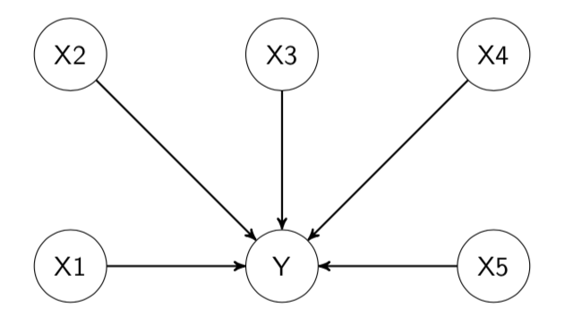

When evaluating a set of environmental exposures, this procedure of fitting a set of independent regression models is usually referred to as environment-wide association study (EWAS, Patel et al. 2010). This approach usually requires correcting for multiple comparisons using wither the Bonferroni approach or the false discovery rate (FDR).

The following table reports results from fitting independent linear regression models (here without any adjustment for multiple comparisons) in our illustrative example with 14 exposures:

```{r, include=FALSE}

lm1 <- lm(y ~ x1 + z1 + z2 + z3, data = data2)
summary(lm1)$coef
lm2 <- lm(y ~ x2 + z1 + z2 + z3, data = data2)
summary(lm2)$coef
lm3 <- lm(y ~ x3 + z1 + z2 + z3, data = data2)
summary(lm3)$coef
lm4 <- lm(y ~ x4 + z1 + z2 + z3, data = data2)
summary(lm4)$coef
lm5 <- lm(y ~ x5 + z1 + z2 + z3, data = data2)
summary(lm5)$coef
lm6 <- lm(y ~ x6 + z1 + z2 + z3, data = data2)
summary(lm6)$coef
lm7 <- lm(y ~ x7 + z1 + z2 + z3, data = data2)
summary(lm7)$coef
lm8 <- lm(y ~ x8 + z1 + z2 + z3, data = data2)
summary(lm8)$coef
lm9 <- lm(y ~ x9 + z1 + z2 + z3, data = data2)
summary(lm9)$coef
lm10 <- lm(y ~ x10 + z1 + z2 + z3, data = data2)
summary(lm10)$coef
lm11 <- lm(y ~ x11 + z1 + z2 + z3, data = data2)
summary(lm11)$coef
lm12 <- lm(y ~ x12 + z1 + z2 + z3, data = data2)
summary(lm12)$coef
lm13 <- lm(y ~ x13 + z1 + z2 + z3, data = data2)
summary(lm13)$coef
lm14 <- lm(y ~ x14 + z1 + z2 + z3, data = data2)
summary(lm14)$coef
```

```{r message=FALSE, results='asis',echo=FALSE} 
stargazer(lm12, lm13, type = "html",single.row = TRUE, ci=TRUE,keep.stat='n')
```
These results seem to indicate that all exposures are independently associated with the outcome (many coefficients fail to reach the conventional threshold of statistical significance, but we will stick on the magnitude and direction of the associations for this illustrative example).

### Multiple regression 

Results from independent linear regression are hampered by the strong assumption that mixture components do not act as confounders of the association between each other component and the outcome of interest. This assumption, however, is very seldom met in practice. A common situation, for example, is that two or more constituents of the mixture share one or more source, which usually results in moderate to high levels of correlation between exposures. Using DAGs, we can depict this situation with the following: 

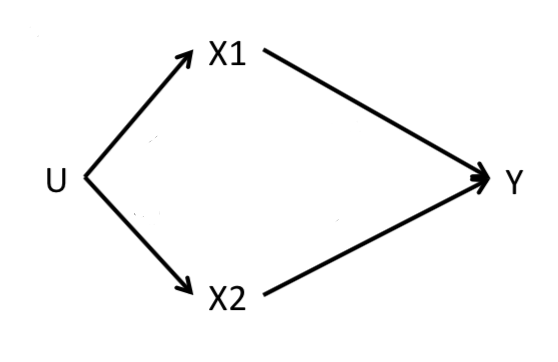

In this situation, a statistical model evaluating the association between $X_1$ and $Y$ will need to adjust for $X_2$ to reduce the impact of bias due to residual confounding. In general, when any level of correlation exists between two mixture components, we do expect them to act as confounders of the association between the other exposure and the outcome. This implies that results from independent linear regressions are likely biased due to uncontrolled confounding. In our illustrative example, for instance, we know that $X_{12}$ and $X_{13}$ are highly correlated; results from independent linear regressions indicated that both exposures are positively associated with the outcome, but we now know that these coefficients are probably biased. Mutually adjusting for the two exposures in the same statistical model is therefore required to account for such confounding and possibly identify whether both exposures are really associated with the outcome, or if the real driver of the association is just one of the two. Note that both situations are realistic: we might have settings where a specific exposure is biologically harmful (say $X_{12}$), and the association between the correlated one ($X_{13}$) and the outcome was a spurious result due to this high correlation, as well as settings where both exposures are really associated with the outcome (maybe because it is the source of exposure to have a direct effect). We need statistical methodologies to be able to detect and distinguish these possible scenarios. 

The most intuitive way to account for co-confounding between mixture components is to mutually adjust for all exposures in the same regression model:

$$E[Y|X,C]=\beta_0+\sum_{i=1}^p\beta_i \cdot X_i + \beta \cdot C$$


The following table presents results from a multiple regression that includes the 14 exposures in our example, as well as results from the independent models for $X_{12}$ and $X_{13}$ for comparison
```{r, include=FALSE}
lmall <- lm(y ~ x1+x2+x3+x4+x5+x6+x7+x8+x9+x10+x11+x12+x13+x14 + z1 + z2 + z3, data = data2)
summary(lmall)$coef
```
We can compare results from different models using the stargazer package. Let's use it to compare results from the full model, and the models for $X_{12}$ and $X_{13}$ alone:
```{r message=FALSE, results='asis',echo=FALSE} 
stargazer(lmall, lm12, lm13, type = "html",single.row = TRUE, ci=TRUE,keep.stat='n')
```

### The problem of Multicollinearity 

Results from the multiple regression are not consistent with those obtained from independent regression models, especially (and unsurprisingly) for those exposures that showed high levels of correlations. For example, within the exposure cluster $X_{12}-X_{13}$, the multiple regression model suggests that only $X_{12}$ is associated with the outcome, while the coefficient of $X_{13}$ is strongly reduced. Something similar happens for the $X_3-X_4-X_5$ cluster, where only $X_4$ remains associated with $Y$. Can we safely conclude that $X_{12}$ and $X_4$ are associated with $Y$ and that the other results were biased due to uncontrolled confounders? Before addressing this question, let's take a look at this published paper where we evaluated the performance of several statistical models to evaluate the association between a mixture of 8 phthalate metabolites and birth weight in a pregnancy cohort (@chiu2018evaluating). The following table presents results from 8 independent regressions and a multiple regression model. The next figure presents instead the correlation plot of the 8 metabolites.

| Metabolite     | $\beta$ (one at the time) |   p-value   |$\beta$ (mutually adjusted) |p-value |
| :---        |    :----:   |          ---: |---: |---: |
|MiBP | -20.0      | 0.51  | -6.8 | 0.84| 
|MBzP | -24.7 | 0.34 | -18.7 |0.53| 
|MEOHP      | -23.7 |0.33| 247.1 |0.11| 
|MnBP     | -28.5   | 0.31  |-6.5 | 0.86| 
|MEHHP     | -28.2   |0.24  | -127.4 | 0.36| 
|MECPP     | -32.6     | 0.20| -82.8 | 0.32| 
|MEP    | -27.1     | 0.18| 25.0| 0.24| 
|MEHP     | -36.8     | 0.10|  -59.0| 0.18| 

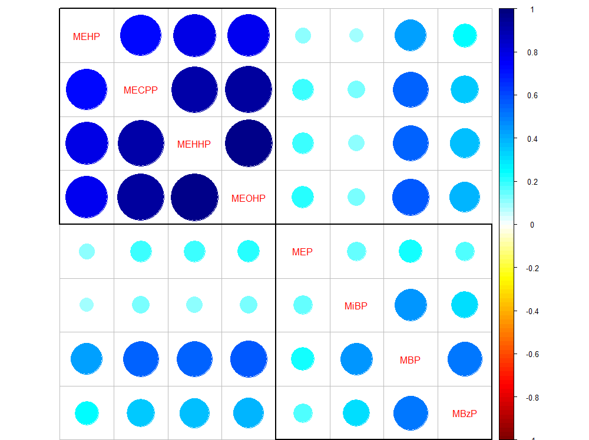

While we were expecting results from the two approaches to be different in the presence of high correlations, the coefficients obtained from the multiple regression leave room to a lot of skepticism. For example, the coefficients for MEOHP and MEHHP, when evaluated together, change respectively from -24 to 247, and from -28 to -127. Are these results reliable? Are we getting any improvement from to the biased results that we obtained from independent linear regressions?

The most common problem that arises when using multiple regression to investigate mixture-outcome association is  multicollinearity (or simply collinearity). This occurs when independent variables in a regression model are correlated, with stronger consequences the higher the correlation. More specifically, a high correlation between two predictors simultaneously included in a regression model will decrease the precision of their estimates and increase their standard errors. If the correlation between two covariates (say $X_1$ and $X_2$) is very high, then one is a pretty accurate linear predictor of the other. Collinearity does not influence the overall performance of the model, but has an important impact on individual predictors. In general (as a rule of thumb), given two predictors $X_1$ and $X_2$ that are associated with the outcome ($\beta=0.2$ for both) when their correlation is equal to 0, the estimates in a linear model will be impacted by $\rho(X_1, X_2)$ as in this figure:
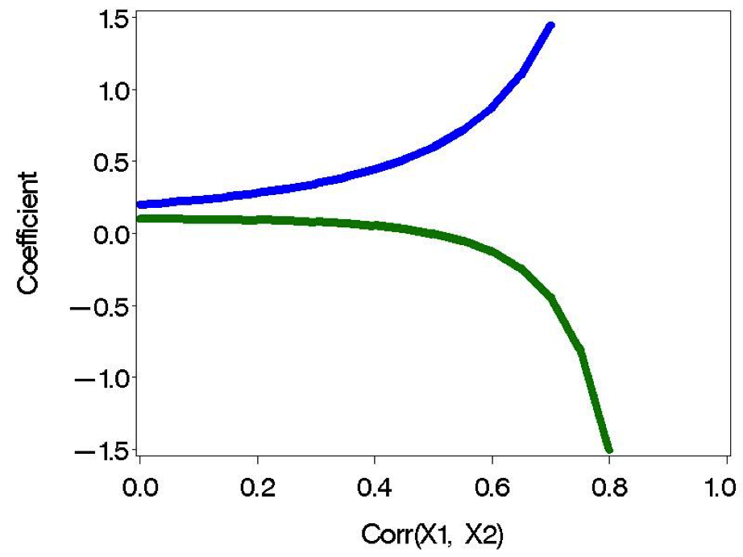

This issue, usually referred to as reverse paradox (the coefficients of 2 correlated covariates will inflate in opposite directions), is clearly affecting results from the paper presented above (the coefficients of highly correlated phthalate metabolites are either extremely large or extremely small), and possibly also results from the illustrative example (coefficients from correlated variables have opposite signs). Nevertheless, it should be noted that high correlation does not automatically imply that coefficients will be inflated. In another example (@bellavia2019urinary), for instance, we evaluated a mixture of three highly correlated parabens compounds, yet results from multiple regression were in line to those obtained from other mixture modeling techniques. 

To quantify the severity of multicollinearity in a regression analysis one should calculate the Variance Inflation Factor (VIF). The VIF provides a measure of how much the variance of an estimated regression coefficient is increased because of collinearity. For example, if the VIF for a given predictors were 4, than the standard error of that predictors is 2 times larger than if that predictor had 0 correlation with other variables. As a rule of thumb, VIFs above 4 should set the alarm off, as they indicate that those coefficients are likely affected by the high correlations between them and other covariates in the model. The following table shows VIFs in our illustrative example, indicating that our results are deeply affected by multicollinearity. In this situation, alternative modeling options should be pursued.

```{r, echo=FALSE, message=FALSE}
knitr::kable(
  car::vif(lmall),
  caption = 'VIFs'
)
```

## Penalized regression approaches

An important set of models that can be very useful in the context of environmental mixtures are penalized regression approaches. These methods are directly built as extensions of standard OLS by incorporating a penalty in the loss function (hence the name). Their popularity in environmental epidemiology is due to the fact that this penalization procedure tends to decrease the influence of collinearity by targeting the overall variability of the model, thus improving the performance of the regression in the presence of high levels of correlations between included covariates. As always, however, everything comes for a price, and the improvement in the variance is achieved by introducing some bias (specifically, coefficients will be shrinked towards zero, reason why these approaches are also referred to as shrinkage procedures).

### Bias-variance tradeoff
The word bias usually triggers epidemiologists' ears, so it is important to understand what we mean by "introducing some bias" and how this can be beneficial in our context. To do so, let's begin by refreshing the basic math behind the estimation of a classical multiple regression. In linear regression modeling, we aim at predicting $n$ observations of the response variable, $Y$, with a linear combination of $m$ predictor variables, $X$, and a normally distributed error term with variance $\sigma^2$:
$$Y=X\beta+\epsilon$$
$$\epsilon\sim N(0, \sigma^2)$$

We need a rule to estimate the parameters, $\beta$, from the sample, and a standard choice to do so is by using ordinary least square (OLS), which produce estimates $\hat{\beta}$ by minimizing the sum of squares of residuals is as small as possible. In other words, we minimize the following loss function:

$$L_{OLS}(\hat{\beta})=\sum_{i=1}^n(y_i-x_i'\hat{\beta})^2=\|y-X\hat{\beta}\|^2$$

 Using matrix notation, the estimate turns out to be :

$$\hat{\beta}_{OLS}=(X'X)^{-1}(X'Y)$$


To evaluate the performance of an estimator, there are two critical characteristics to be considered: its bias and its variance. The bias of an estimator measures the accuracy of the estimates:

$$Bias(\hat{\beta}_{OLS})=E(\hat{\beta}_{OLS})-\beta$$

The variance, on the other hand, measures the uncertainty of the estimates:

$$Var(\hat{\beta}_{OLS})=\sigma^2(X'X)^{-1}$$

Think of the estimator as an olympic archer:
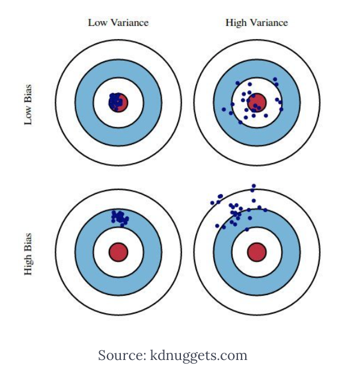

The best performer will be an archer with low bias and low variance (top-left), who consistently aims the target for every estimate. An archer with low bias but high variance will be the one who will shoot inconsistently around the center (top-right), but we may also have an archer with high bias and low variance, who is extremely precise in consistently shooting at the wrong target (bottom-left). Now, the OLS estimator is an archer who is designed to be unbiased, but in certain situations might have a very high variance, situation that commonly happens when collinearity is a threat, as documented by the inflation in the variance calculated by the VIF. 

To assess the overall performance an estimator by taking into account both bias and variance, one can look at the Mean Squared Error (MSE), defined as the sum of Variance and squared Bias.

$$MSE=\frac{1}{n}\sum_{i=1}^n(Y_i-\hat{Y_i})^2=Var(\hat{\beta})+Bias^2(\hat{\beta})$$

The basic idea of bias-variance tradeoff is to introduce some bias in order to minimize the mean squared error in those situation where the performances of OLS are affected by high variance. This is achieved by augmenting the loss function by introducing a penalty. While there are several ways of achieving this, we will here focus on 3 common penalty functions that originate Ridge, LASSO, and Elastic-Net regression, with the latter being a generalized version of the previous 2.


### Ridge regression

Ridge regression augments the OLS loss function as to not only minimize the sum of squared residuals, but also penalize the size of the parameter estimates, shrinking them towards zero

$$L_{ridge}(\hat{\beta})=\sum_{i=1}^n(y_i-x_i'\hat{\beta})^2+\lambda\sum_{j=1}^m\hat{\beta}_j^2=\|y-X\hat{\beta}\|^2+\lambda\|\hat{\beta}\|^2$$

Minimizing this equation provides this solution for the parameters estimation:
$$\hat{\beta}_{ridge}=(X'X+\lambda I)^{-1}(X'Y)$$ 
where $\lambda$ is the penalty and $I$ an identity matrix

We can notice that: As $\lambda\rightarrow 0$, $\hat{\beta}_{ridge}\rightarrow\hat{\beta}_{OLS}$, while as $\lambda\rightarrow \infty$, $\hat{\beta}_{ridge}\rightarrow 0$. In words, setting $\lambda$ to 0 is like using OLS, while the larger its value, the stronger the penalization. The unique feature of Ridge regression, as compared to other penalization techniques, is that coefficients can be shrinked over and over but will never reach 0. In other words, all covariates will always remain the model, and Ridge does not provide any form of variable selection.

It can be shown that as $\lambda$ becomes larger, the variance decreases and the bias increases. How much are we willing to trade?
There are several approaches that can be used to choose for the best value of $\lambda$:

- Choose the $\lambda$ that minimizes the MSE
- Use a traditional approach based on AIC or BIC criteria, to evaluate the performance of the model in fitting the data. While software tend to do the calculation automatically, it is important to remember that the degrees of freedom of a penalized model, needed to calculate such indexes, are different from the degrees of freedom of a OLS model with the same number of covariates/individuals. 
- Finally, a recommended procedure is based on cross-validation, focusing more on the predictive performances of the model. More specifically, to avoid the the model perfectly fits our data with poor generalizability (situation commonly known as overfitting in the machine learning vocabulary), we tend to select the model corresponding to the largest $\lambda$ within one unit of standard deviation around the $\lambda$ that minimizes the MSE.

Let's turn to our illustrative example to see Ridge regression in practice. Given that both ridge and lasso are special cases of elastic net, we are going to use the `glmnet` package for all 3 approaches. Alternative approaches are available and could be considered. First,let's define a set of potential values of $\lambda$ that we will then evaluate; the following chunk of code generates a set of potential value, in addition to defining outcome, exposures, and confounders, as well as a seed that will be required for the section of analyses involving cross validation.


```{r define lambda, echo=FALSE}
set.seed(123)   
X<-as.matrix(data2[,3:16])
Y<-data2$y
lambdas_to_try <- 10^seq(-3, 5, length.out = 100)
```

To select the optimal $\lambda$ we are going to use the 10-fold cross validation approach, which can be conducted with the `cv.glmnet` command. Note that with option `standardize=TRUE` exposure will be standardized; this can be set to FALSE if standardization has been already conducted. Also, the option `alpha=0` has to be chosen to conduct Ridge regression (we will see later that Ridge is an Elastic Net model where an $\alpha$ parameter is equal to 0) 

```{r CV}
ridge_cv <- cv.glmnet(X, Y, alpha = 0, lambda = lambdas_to_try,
                      standardize = TRUE, nfolds = 10)
```
We can now plot the MSE at different levels of $\lambda$. While the goal is to find the model that minimizes the MSE (`lambda.min`), we don't want the model to overfit our data. For this reason we tend to select the model corresponding to the largest $\lambda$ within one unit of standard deviation around `lambda.min` (`lambda.1se`). The following figure shows the plot of MSE over levels of $\lambda$, also indicating these 2 values of interest


```{r figureridge, fig.cap='MSE vs lambda for ridge', out.width='80%', fig.asp=.75, fig.align='center', echo=FALSE}
plot(ridge_cv)
```
```{r CV plot, echo=TRUE}
# lowest lambda
lambda_cv_min <- ridge_cv$lambda.min
lambda_cv_min
# Best cross-validated lambda
lambda_cv <- ridge_cv$lambda.1se
lambda_cv
```

Another useful figure is the trajectory of coefficients at varying levels of $\lambda$:
```{r figureridge2, fig.cap='coefficients trajectories for ridge', out.width='80%', fig.asp=.75, fig.align='center', echo=FALSE}
res <- glmnet(X, Y, alpha = 0, lambda = lambdas_to_try, standardize = TRUE)
plot(res, xvar = "lambda")
legend("bottomright", lwd = 1, col = 1:14, legend = colnames(X), cex = .7)

```
The starting values on the left of the figure are the ones from OLS estimation, and then we see how coefficients get shrinked at increasingly higher levels of $\lambda$. Note that the shrinkage is operated on the entire model, and for this reason individual trajectories are not necessarily forced to decrease (here some coefficients become larger before getting shrinked). Also, from the numbers plotted on top of the figure, indicating the number of coefficients that are still included in the model, we can see that coefficients only tend asymptotically to 0 but are never really removed from the model.

Finally, we can summarize the results of our final model for the selected value of lambda:

```{r, tidy=FALSE}
model_cv <- glmnet(X, Y, alpha = 0, lambda = lambda_cv, standardize = TRUE)
knitr::kable(
 summary(model_cv$beta),
  caption = 'Ridge'
)
```

These results can provide some useful information but are of little use in our context. For example, we know from our VIF analysis that the coefficients for $X_{12}$ and $X_{13}$ are affected by high collinearity, but we would like to understand whether a real association exists for both exposures or whether one of the 2 is driving the cluster. To do so, we might prefer to operate some sort of variable selection, constructing a penalty so that non-influential covariates can be set to 0 (and therefore removed). This is what LASSO does.  

### LASSO


Lasso, standing for Least Absolute Shrinkage and Selection Operator, also adds a penalty to the loss function of OLS. However, instead of adding a penalty that penalizes sum of squared residuals (L2 penalty), Lasso penalizes the sum of their absolute values (L1 penalty). As a results, for high values of $\lambda$, many coefficients are exactly zeroed under lasso, which is never the case in ridge regression (where 0s are the extreme case as $\lambda\rightarrow\infty$). Specifically, the Lasso estimator can be written as
\end{itemize}
$$L_{lasso}(\hat{\beta})=\sum_{i=1}^n(y_i-x_i'\hat{\beta})^2+\lambda\sum_{j=1}^m|\hat{\beta}_j|$$
\end{frame}

As before, let's  turn to our illustrative example to understand properties and interpretation. The procedure in R is exactly the same, with the only difference that the parameter $\alpha$ is set to 1. First, let's identify the optimal value of $\lambda$ using the cross validation procedure,

```{r CVlasso}
lasso_cv <- cv.glmnet(X, Y, alpha = 1, lambda = lambdas_to_try,
                      standardize = TRUE, nfolds = 10)
```


```{r figurelasso, fig.cap='MSE vs lambda for lasso', out.width='80%', fig.asp=.75, fig.align='center', echo=FALSE}
plot(lasso_cv)
```

```{r CV plotl, echo=TRUE}
# lowest lambda
lambda_cv_min_lasso <- lasso_cv$lambda.min
lambda_cv_min_lasso
# Best cross-validated lambda
lambda_cv_lasso <- lasso_cv$lambda.1se
lambda_cv_lasso
```

and then plot the coefficients trajectories. 
```{r figurelasso2, fig.cap='coefficients trajectories for lasso', out.width='80%', fig.asp=.75, fig.align='center', echo=FALSE}
res_lasso <- glmnet(X, Y, alpha = 1, lambda = lambdas_to_try, standardize = TRUE)
plot(res_lasso, xvar = "lambda")
legend("bottomright", lwd = 1, col = 1:14, legend = colnames(X), cex = .7)

```

We see that, differently from what observed in Ridge regression, coefficients are shrinked to a point where they exactly equal 0, and are therefore excluded from the model. The numbers on top of Figure 3.4 show how many exposures are left in the model at higher levels of $\lambda$. Finally, let's take a look at the results of the optimal selected model.


```{r, tidy=FALSE}
model_cv_lasso <- glmnet(X, Y, alpha = 1, lambda = lambda_cv_lasso, standardize = TRUE)
knitr::kable(
 summary(model_cv_lasso$beta),
  caption = 'Lasso'
)
```


The final model selects only 6 covariates, while all other 8 drop to 0. If we look at our 2 established groups of correlated exposures, $X_4$ and $X_{12}$ are selected, while the others are left out. In general, Lasso's results may be very sensitive to weak associations, dropping coefficients that are not actually 0. Lasso can set some coefficients to zero, thus performing variable selection, while ridge regression cannot. The two methods solve multicollinearity differently: in ridge regression, the coefficients of correlated predictors are similar, while in lasso, one of the correlated predictors has a larger coefficient, while the rest are (nearly) zeroed. Lasso tends to do well if there are a small number of significant parameters and the others are close to zero (that is - when only a few predictors actually influence the response). Ridge works well if there are many large parameters of about the same value (that is - when most predictors impact the response). 


### Elastic net


Rather than debating which model is better, we can directly use Elastic Net, which has been designed as a compromise between Lasso and Ridge, attempting to overcome their limitations and performing variable selection in a less rigid way than Lasso. Elastic Net combines the penalties of ridge regression and Lasso, aiming at minimizing the following loss function

$$L_{enet}(\hat{\beta})=\frac{\sum_{i=1}^n(y_i-x_i'\hat{\beta})^2}{2n}+\lambda\left(\frac{1-\alpha}{2}\sum_{j=1}^m\hat{\beta}_j^2+\alpha\sum_{j=1}^m|\hat{\beta}_j|\right)$$

where $\alpha$ is the mixing parameter between ridge ($\alpha$=0) and lasso ($\alpha$=1). How this loss function is derived, given the ridge and lasso ones, is described in @zou2005regularization. Procedures to simultaneously tune both $\alpha$ and $\lambda$ to retrieve the optimal combinations are available and developed in the R package `caret`. For simplicity we will here stick on `glmnet`, which requires pre-defining a value for $\alpha$. One can of course fit several models and compare them with common indexes such as AIC or BIC. To ensure some variable selection, we may for example choose a value of $\lambda$ like 0.7, closer to Lasso than to Ridge. Let's fit an Elastic Net model, with $\alpha=0.7$ in our example. First, we need to select the optimal value of $\lambda$: 

```{r CVenet}
enet_cv <- cv.glmnet(X, Y, alpha = 0.7, lambda = lambdas_to_try,
                     standardize = TRUE, nfolds = 10)
```

```{r figureenet, fig.cap='MSE vs lambda for elastic net', out.width='80%', fig.asp=.75, fig.align='center', echo=FALSE}
plot(enet_cv)
```

```{r CV ploten, echo=TRUE}

lambda_cv_min_enet <- enet_cv$lambda.min
lambda_cv_min_enet
# Best cross-validated lambda
lambda_cv_enet <- enet_cv$lambda.1se
lambda_cv_enet
```
and plot the coefficients' trajectories.
```{r figureenet2, fig.cap='coefficients trajectories for elastic net', out.width='80%', fig.asp=.75, fig.align='center', echo=FALSE}
res_enet <- glmnet(X, Y, alpha = 0.7, lambda = lambdas_to_try, standardize = TRUE)
plot(res_enet, xvar = "lambda")
legend("bottomright", lwd = 1, col = 1:14, legend = colnames(X), cex = .7)

```

We see that coefficients are shrinked to a point where they exactly equal 0, and therefore excluded from the model, but that this happens more conservatively as compared to Lasso (as documented from the numbers on top). Let's take a look at the results of the optimal selected model.


```{r, tidy=FALSE}
model_cv_enet <- glmnet(X, Y, alpha = 0.7, lambda = lambda_cv_enet, standardize = TRUE)
knitr::kable(

summary(model_cv_enet$beta),
  caption = 'Lasso'
)
```

As expected, less covariates are dropped to 0. Unfortunately, however, all components of the group of correlated covariates $X_3-X_5$ remain in the model, and we are not able to identify the key actor of that group. Before getting deeper into the discussion of these results, however, it is useful to incorporate the potential confounders available in the data. Including confounders can be done by specifying them in the model as we do in a regular OLS model. However, we may want them to be involved in the selection process. To such end, the best way is to include them in the matrix of covariates to be penalized, but inform the CV procedure that you don't want their coefficients to be modified. The following chunk of code will do that:

```{r CVenetadjust}
X<-as.matrix(data2[,3:19])

enet_cv_adj <- cv.glmnet(X, Y, alpha = 0.6, lambda = lambdas_to_try,
                     standardize = TRUE, nfolds = 10, penalty.factor=c(rep(1,ncol(X) - 3),0,0,0))
```

```{r figureenetadjasdfasdf, fig.cap='MSE vs lambda for elastic net, adjusted for confounders', out.width='80%', fig.asp=.75, fig.align='center', echo=FALSE}
plot(enet_cv_adj)
```

```{r CV plotenadj, echo=TRUE}

lambda_cv_min_enet_adj <- enet_cv_adj$lambda.min
lambda_cv_min_enet_adj
# Best cross-validated lambda
lambda_cv_enet_adj <- enet_cv_adj$lambda.1se
lambda_cv_enet_adj
```


Note that, regardless of how large $\lambda$ will be, the three confounders will remain non-penalized in the model, as documented from the numbers on top. Here the final results:


```{r, tidy=FALSE}
model_cv_enet_adj <- glmnet(X, Y, alpha = 0.6, lambda = lambda_cv_enet, standardize = TRUE,penalty.factor=c(rep(1,ncol(X) - 3),0,0,0))
knitr::kable(

summary(model_cv_enet_adj$beta),
  caption = 'Lasso, adjusted'
)
```


In addition to the 3 confounders (now named $X_{15}-X_{17}$) only 4 covariates did not drop to 0. Interestingly, we are now selecting none of the 3 covariates we wanted to distinguish. Results seem to agree with multiple regression in indicating $X_6$ and $X_{12}$ as the main predictors of the outcome.


### Additional notes

We have covered the basic theory of penalized regression techniques (also referred to with other common terminology such as shrinkage procedures, or regularization processes). Before moving to the presentation of two examples of application of these techniques in environmental epidemiology, let's mention some additional details. 

- Replicate results in classical OLS

When Elastic Net is used to describe associations in population-based studies, it is common practice to also present a final linear regression model that only includes those predictors that were selected from the penalized approach. This model will ensure better interpretation of the coefficients, and hopefully not be subject anymore to issues of collinearity that the selection should have addressed. Here are the results from such model in our illustrative example, based on covariates selected by the final adjusted elastic net model.

```{r olss, include=FALSE}

lmall <- lm(y ~ x1+x2+x3+x4+x5+x6+x7+x8+x9+x10+x11+x12+x13+x14 + z1 + z2 + z3, data = data2)
lmselected <- lm(y ~ x6+x9+x10+x12 + z1 + z2 + z3, data = data2)
summary(lmselected)$coef

```
```{r message=FALSE, results='asis', echo=FALSE} 
stargazer(lmselected, lmall, type = "html",single.row = TRUE, ci=TRUE,keep.stat='n')
```

- Grouped Lasso

In some settings, the predictors belong to pre-defined groups, or we might have observed well-defined subgroups of exposures from our PCA. In this situation one may want to shrink and select together the members of a given group, which can be achieved with grouped Lasso. The next section will provide alternative regression approaches where preliminary grouping information can be used to address some limitations of standard regression.

- Time-to-event outcomes

Recent developments allow fitting Elastic Net with time-to-event outcomes, within the context of a regularized Cox regression model. Given the popularity of this method in epidemiology it is reasonable to expect that this approach will become more popular in the context of environmental mixture since (as we will see in next sections) methods that were built ad-hoc do not always account for these types of outcomes. A first R package was develop in 2011 (`coxnet`), fully documented [here](https://cran.r-project.org/web/packages/glmnet/vignettes/Coxnet.pdf), and those algorithms for right-censored data have also been included in the most recent version of `glmnet` 

- Non-linear associations

An implicit assumption we have made so far is that each covariate included in the model has a linear (or log-linear) effect on the outcome of interest. We know that this is often not true (several environmental exposures, for example, have some kind of plateau effect) and we might want to be able to incorporate non-linearities in our analyses. While classical regression can flexibly allow incorporating non-linearities by means of techniques such as restricted cubic splines, this is not of straightforward application in penalized regression. In complex settings where strong departures from linearity are observed in preliminary linear regressions, one should probably consider more flexible techniques such as BKMR (Section 5).


### Elastic Net and environmental mixtures

Using Elastic Net to evaluate the association between a mixture of environemtanl exposures and a health outcome is becoming increasingly popular. A nice and rigorous application of the method can be found  in @lenters2016prenatal, evaluating co-exposure to 16 chemicals as they relate to birth weight in 1250 infants. Here the correlation plot from the manuscript,
 
/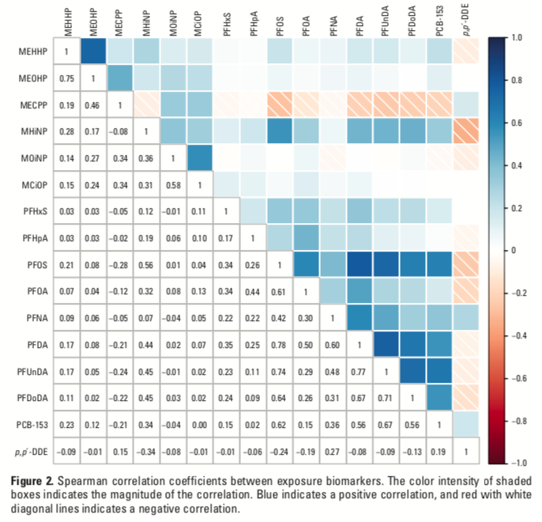


and here results presenting, respectively, the Elastic Net model, and the final OLS only including selected covariates. 
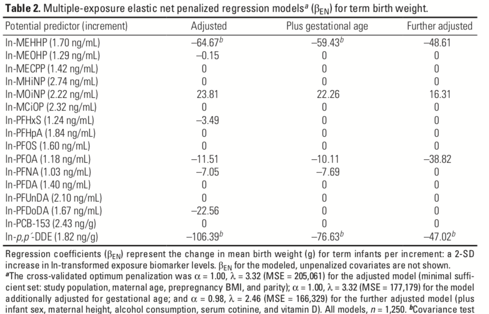

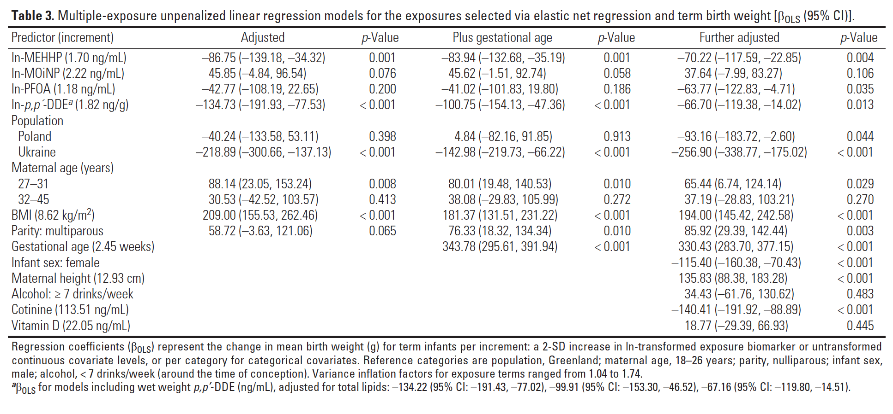

Another application that thoroughly report methods presentation, stating all assumptions and clearly discussing the results, can be seen in @vriens2017neonatal, evaluating environmental pollutants and placental mitochondrial DNA content in infants. This is the starting correlation plot reported in the paper:

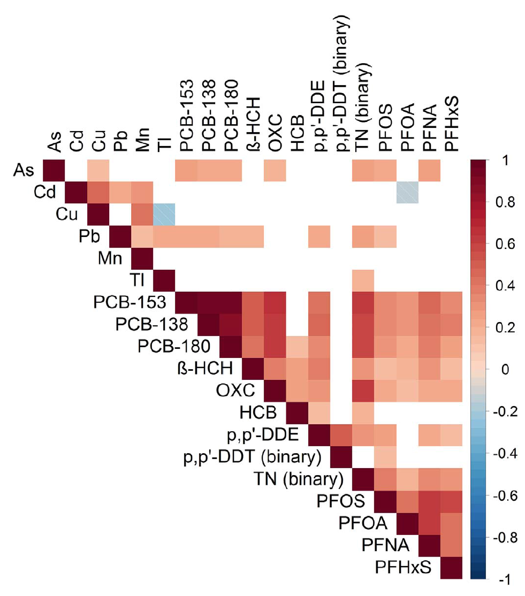
Several detailed figures are used to present results providing the reader with all necessary tools to understand associations and provide clear interpretation.

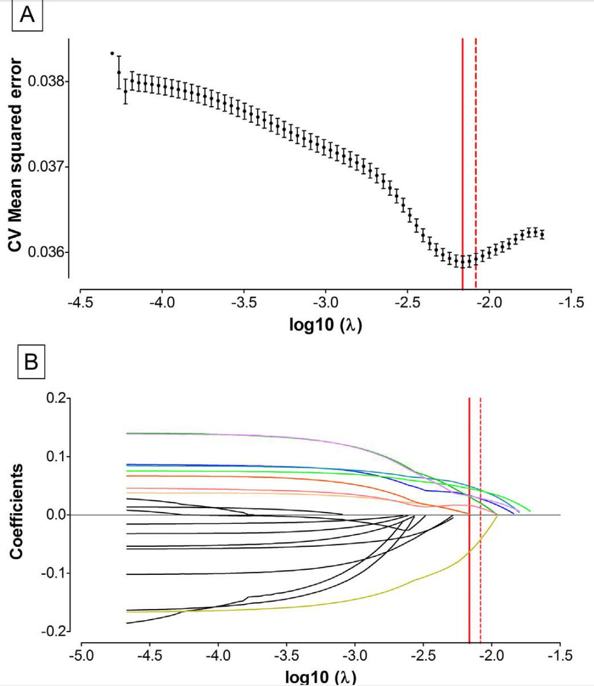


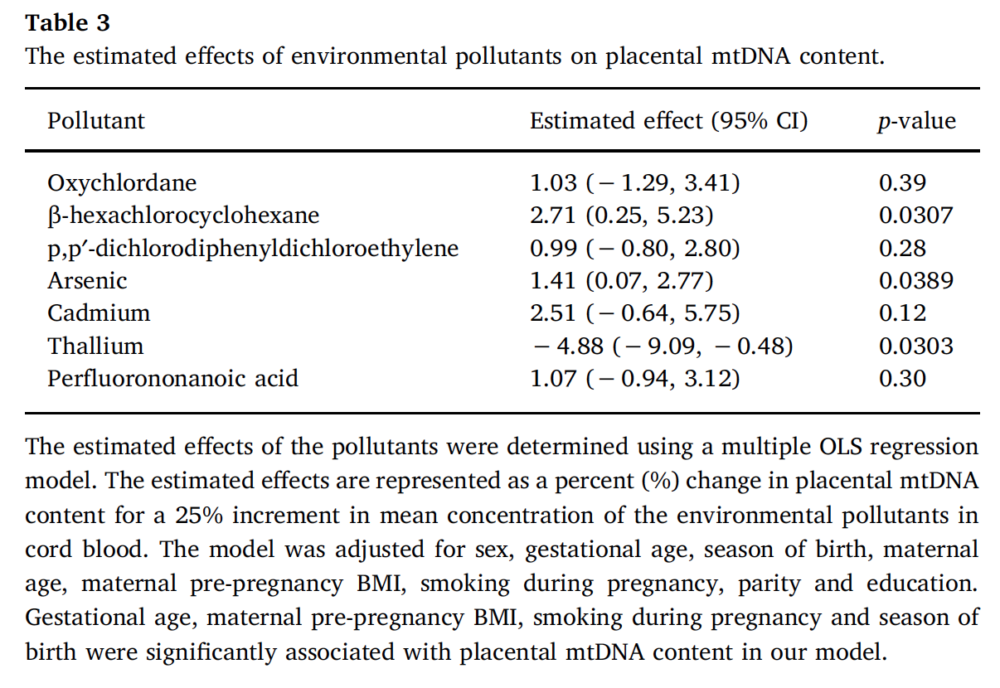


## Other regression-based approaches

Before moving on to the a general discussion on advantages and limitations of regression-based approaches, and introduce and motivate further approaches for environmental mixtures, it is useful to provide a broad overview of some alternative approaches based on or derived from classical regression that have proven useful in this context.

### Hierarchical linear models

Hierarchical modeling allows improving performances of a multiple regression model when clustering of exposures can be clearly identified. Application of this approach for multiple exposures was first introduced to evaluate the effect of antiretroviral treatments in HIV epidemiology, where several drugs belonging to clearly defined drug classes are usually defined (@correia2019hierarchical). In brief, the model incorporates first-stage effects for each drug class, and second-stage effects for individual drugs, assuming that the effect of each drug is the summation of the (fixed) effect of its drug class and a residual effect specific to the individual drug. Assuming that we can identify (or observe from preliminary analysis such as a PCA) well characterized subgroups of environmental exposures, this modeling technique can be used to improve the performance of multiple regression when focusing on environmental mixtures. Potential advantages include the absence of variable selection and shrinkage,thus allowing a better interpretation of results. 

### Partial least square regression

The Partial least square (PLS) regression can be seen as a method that generalizes and combines PCA and multiple regression. PLS regression is very useful to predict dependent variables from a very large number of predictors that might be highly correlated.  The PLS regression replaces the initial independent variable space (X) and the initial response variable space (Y) by smaller spaces that rely on a reduced number of variables named latent variables, which are included one by one in an iterative process. The sparse PLS (sPLS) regression, in particular, is an extension of PLS that aims at combining variable selection and modeling in a one-step procedure (@le2008sparse). Components are defined iteratively such that they explain as much of the remaining covariance between the predictors and the outcome as possible. The sPLS approach simultaneously yields good predictive performance and appropriate variable selection by creating sparse linear combinations of the original predictors. Sparsity is induced by including a penalty (η) in the estimation of the linear combination coefficients; that is to say, all coefficients with an absolute value lower than some fraction η of the maximum absolute coefficient are shrunk to zero. Only the first K components are included as covariates in a linear regression model, calibrating  K and η  by minimizing the RMSE using 5-fold cross-validation (the default implementation). sPLS is available in the R package `spls` , documented [here](https://cran.r-project.org/web/packages/spls/vignettes/spls-example.pdf). A good illustration of using sPLS in environmental epidemiology can be found in @lenters2015phthalates.


## Advantages and limitations of regression approaches

Together with underlying some of the limitations of single and multiple regression in evaluating the effects of environmental mixtures on health outcomes, primarily due to the main problem of multicollinearity, this Section has also introduced techniques that overcome such limitation while remaining embedded in a regression framework. Among these techniques, review articles and simulation studies agree in concluding that penalized regression consistently outperformed conventional approaches, and that the choice of what method to use should be selected based on one-by-one situation. I recommend reading this paper from @agier2016systematic,  systematically comparing methods based on regression in exposome-health analyses. 

In practical settings, several research questions can be addressed by using multiple regression or its extensions. Nevertheless, there might be research questions that are beyond the reach of regression techniques and for which some additional methodologies should be considered.

- Assessing the overall mixture effect. 

Penalized approaches addressed the issues of collinearity and high-dimension by operating some sort of variable selection. While this allows retrieving information on the actual effects for each selected component, addressing other questions such as the ones related to the overall effect of the mixture can not be evaluated. As discussed in Section 1, this is a relevant research question that is often of primary interest. The next section will address this problem, introducing the weighted quantile sum (WQS) regression framework as a technique to evaluate the overall effect of an environmental mixture while taking into account high levels of correlation.

- Complex scenarios with several exposures and interactive mechanisms.

When the mixture of interest is composed by several exposures, it is likely that the mixture-outcome association will involve non-linear and interactive mechanisms. As the number of potential predicors gets higher, so does the complexity of the model. In such situations the performances of regression-based approaches are generally weak, and more flexible algorithms should be taken into considerations. These problems will be assessed in section 6, introducing Bayesian kernel Machine Regression as a flexible non-parametric approach to estimate the mixture-outcome association in the presence of complex non-linear and interactive mechanisms, and then discussing techniques for the assessment of high-dimensional interactions, including machine learning algorithms based on trees modeling. 


