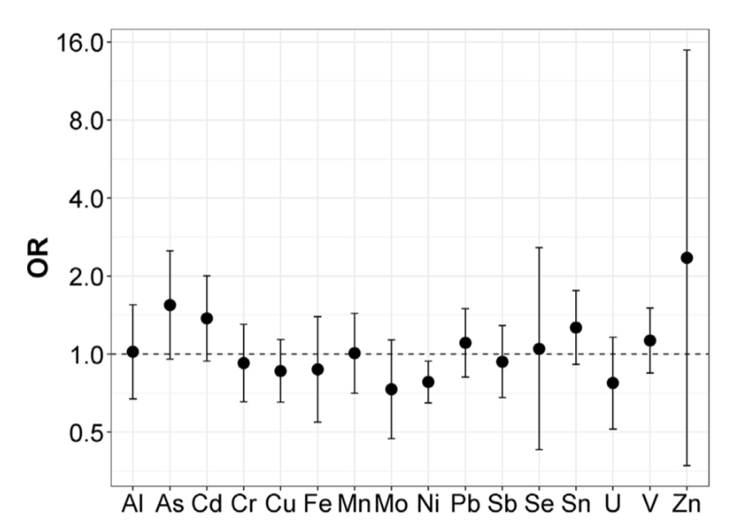
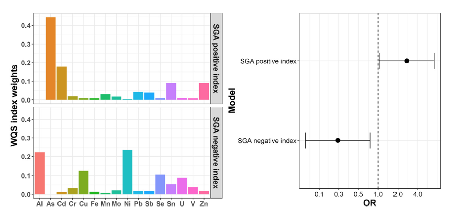

```{r, include=FALSE}
Packages <- c("readxl", "bkmr", "qgraph", "gWQS", "qgcomp", "corrplot", "cluster","factoextra","gridExtra","table1","stargazer","glmnet")
lapply(Packages, library, character.only = TRUE)
data2<- read_excel("C:/Users/AI880/Dropbox/Teaching/Environmental mixtures/2021_EH550/labs/dataset2xls.xls")
#data2 <- read_excel("~/Dropbox/Teaching/Environmental Mixtures/2021_EH550/labs/dataset2xls.xls")
```

# Assessing the overall (cumulative) effect of multiple exposures

Extensions of linear regression presented in the previous chapter address the complexity of the mixture-outcome association by selecting relevant predictors within the mixture, thus removing covariates that would create problems due to high collinearity, or simply by reducing the dimension of the exposure matrix thus improving the fit of the model. This approach, however, also comes with relevant drawbacks. 

Let's think of the group of highly correlated exposures from our hypothetical example ($X_3-X_4-X_5$), where penalized approaches recommended only selecting $X_4$. This allowed evaluating the independent effect of $X_4$ on the outcome without being troubled by the high levels of correlation between this covariate and the other 2 of the cluster. This same selection, however, is preventing us to address other important questions. For example, what if there is an interaction between $X_3$ and $X_4$ (this can happen even if $X_3$ does not have an independent effect on the outcome, but only an effect that is triggered in the presence of the other co-exposure)? By removing $X_3$ from the model, we will not be able to evaluate this interaction. Moreover, we will not be able to correctly quantify the joint effect of $X_3$ and $X_4$, which is the sum of the two main effects and their 2-way interaction. As discussed in the first chapter, this is a very important research question: the three correlated exposures might for instance come from the same source, and quantifying their joint effect would in this case provide useful information on the public health benefits of reducing exposure to the source. 

The question that we will address in this section is the following: how do we quantify the joint effect of several exposures, possibly highly correlated, when regression techniques are not functional?

## Unsupervised summary scores

A very intuitive approach is to create one or more summary score(s) that summarize individual levels of exposure to the mixture, thus reducing the numbers of covariates that are going to be evaluated. A very common example of such approach is used by investigators working on phthalates. In this context, analyses are often hampered by the presence of extreme correlation between metabolites of Di(2-ethylhexyl)phthalate (DEHP), and researchers are commonly summarizing this information into a molar sum of DEHP. @li2019serum writes, for example "we calculated the molar sum of DEHP metabolites (ΣDEHP) by dividing
each metabolite concentration by its molecular weight and then
summing: ΣDEHP=[MEHP (μg/L)×(1/278.34 (g/mol))]+[MEHHP
(μg/L) × (1/294.34 (g/mol))] + [MEOHP (μg/L) × (1/292.33 (g/
mol))] + [MECPP (μg/L) × (1/308.33 (g/mol))]". Note that, with this approach, the score targets a selected sub-sample of exposures (the highly-correlated cluster creating problems), and other phthalates metabolites are included in the model without any transformation. 

Another common approach is to use components derived from PCA, as described in section 3. PCA allows identifying continuous covariates that summarize the variability of the mixture exposure. Including these derived components into a regression model has the great advantage that all collinearity issues will be resolved, as the components are uncorrelated by definition. On the other hand, the validity of this approach is severely affected by whether the obtained components have clear biological interpretation. A good example of this approach can be found in @souter2020urinary.


## Weighted quantile sum 

Taking one step further, researchers might be interested in taking into account the relationship between the exposures and the outcome while summarizing the complex exposure to the mixture of interest. The weighted quantile sum (WQS), developed specifically for the context of environmental mixtures analysis, is an increasingly common approach that allows evaluating a mixture-outcome association by creating a summary score of the mixture in a supervised fashion (@czarnota2015assessment), (@carrico2015characterization). Specifically, WQS is a statistical model for multivariate regression in high-dimensional dataset that operates in a supervised framework, creating a single score (the weighted quantile sum) that summarizes the overall exposure to the mixture, and by including this score in a regression model to evaluate the overall effect of the mixture on the outcome of interest. The score is calculated as a weighted sum (so that exposures with weaker effects on the outcome have lower weight in the index) of all exposures categorized into quartiles, or more groups (so that extreme values have less impact on the weight estimation. 


### Model definition and estimation
Most of what follows in this subsection is taken from the excellent introductory material shared online by Dr. Renzetti at this [link](https://cran.r-project.org/web/packages/gWQS/vignettes/gwqs-vignette.html), which should be referred to for further details on the technique.

The WQS model takes the following form:

\begin{equation} \label{eq:wqs}
g(\mu) = \beta_0 + \beta_1\Bigg(\sum_{i=1}^{c}w_iq_i\Bigg) + \boldsymbol{z'\varphi}
\end{equation}

 The $(\sum_{i=1}^{c}w_iq_i)$ term represents the index that weights and sums the components included in the mixture. As such, $\beta_1$ will be the parameter summarizing the overall effect to the (weighted) mixture. In addition, the model will also provide an estimate of the individual weights $w_i$ that indicate the relative importance of each exposure in the mixture-outcome association.
 
 To estimate the model, the data may be split in a training and a validation dataset: the first one to be used for the weight estimation, the second one to test for the significance of the final WQS index. The weights are estimated through a bootstrap and constrained to sum to one and bounded between zero and one: $\sum_{i=1}^{c}w_i=1$ and $0 \leq w_i \leq 1$. For each bootstrap sample (usually $B=100$ total samples) a dataset is created sampling with replacement from the training dataset and the parameters of the model are estimated through an optimization algorithm.An inequality constraint is also applied in order to impose that $0 \leq w_i \leq 1$.
 
Once the weights are estimated, the model is fitted in order to find the regression coefficients in each ensemble step. After the bootstrap ensemble is completed, the estimated weights are averaged across bootstrap samples to obtain the WQS index:

$$WQS = \sum_{i=1}^c \bar{w}_iq_i$$

Typically weights are estimated in a training set then used to construct a WQS index in a validation set, which can be used to test for the association between the mixture and the health outcome in a standard generalized linear model, as:

$$g(\mu) = \beta_0 + \beta_1WQS + \boldsymbol{z'\varphi}$$

After the final model is fitted one can test the significance of the $\beta_1$ to see if there is an association between the WQS index and the outcome. In the case the coefficient is significantly different from 0 then we can interpret the weights: the highest values identify the associated components as the relevant contributors in the association. A selection threshold can be decided a priori as $\tau = 1/c$ to identify those chemicals that have a significant weight in the index. 


###  The unidirectionality assumption 

WQS makes an important assumption of uni-direction (either a positive or a negative) of all exposures with respect to the outcome. The model is inherently one-directional, in that it tests only for mixture effects positively or negatively associated with a given outcome. In practice analyses should therefore be run twice to test for associations in either direction. 

The one-directional index allows not to incur in the reversal paradox when we have highly correlated variables thus improving the identification of bad actors.


### Extensions of the original WQS regression 

- Dependent variables

The WQS regression can be generalized and applied to multiple types of dependent variables. In particular, WQS regression has been adapted to four different cases: logistic, multinomial, Poisson and negative binomial regression. For these last two cases it is also possible to fit zero-inflated models keeping the same objective function used to estimate the weights as for the Poisson and negative binomial regression but taking into account the zero inflation fitting the final model.


- Random selection 

A novel implementation of WQS regression for high-dimensional mixtures with highly correlated components was proposed in @curtin2021random. This approach applies a random selection of a subset of the variables included in the mixture instead of the bootstrapping for parameter estimation. Through this method we are able to generate a more de-correlated subsets of variables and reduce the variance of the parameter estimates compared to a single analysis. This novel statistical methodology was shown to be more effective compared to WQS in modeling contexts with large predictor sets, complex correlation structures, or where the numbers of predictors exceeds the number of subjects.


- Repeated holdout validation for WQS regression

One limit of WQS is the reduced statistical power caused by the necessity to split the dataset in training and validation sets. This partition can also lead to unrepresentative sets of data and unstable parameter estimates. A recent work from @tanner2019repeated showed that conducing a WQS on the full dataset without splitting in training and validation produces optimistic results and proposed to apply a repeated holdout validation combining cross-validation and bootstrap resampling. They suggested to repeatedly split the data 100 times with replacement and fit a WQS regression on each partitioned dataset. Through this procedure we obtain an approximately normal distribution of the weights and the regression parameters and we can apply the mean or the median to estimate the final parameters. A limit of this approach is the higher computational intensity.

- Additional approaches 

To complete the set of currently available extensions of this approach, it is finally worthy to mention the Bayesian WQS (@colicino2020per), which also allows relaxing the uni-directional assumption, and the lagged WQS (@gennings2020lagged), which deals with time-varying mixtures of exposures to understand the role of exposure timing.  

### Quantile G-computation

A recent paper by @keil2020quantile introduced an additional modeling technique for environmental mixture that builds up on WQS regression integrating its estimation procedure with g-computation. This approach, called Quantile-based g-Computation estimates the overall mixture effect with the same procedure used by WQS, but estimating the parameters of a marginal structural model, rather than a standard regression. In this way, under common assumptions in causal inference such as exchangeability, causal consistency, positivity, no interference, and correct model specification, this model will also improve the causal interpretation of the overall effect. Importantly, the procedure also allegedly overcomes the assumption of uni-direction, and the flexibility of marginal structural models also allows incorporating non-linearities in the contribution of each exposure to the score. Additional details on the models can be found on the original paper or in this useful R [vignette](https://cran.r-project.org/web/packages/qgcomp/vignettes/qgcomp-vignette.html). 


### WQS regression in R

WQS is available in the R package `gWQS` (standing for generalized WQS). Documentation and guidelines can be found [here](https://cran.r-project.org/web/packages/gWQS/gWQS.pdf). Note that if you are working on a mac with a OS different than OS 10.5 through 10.7, you may have to install X Quartz at https://www.xquartz.org, before being able to load the `gWQS` library. The recently developed quantile G-computation approach is instead available in the `qgcomp` package. 

Fitting WQS in R will require some additional data management. First of all, both `gWQS` and `qgcomp` will require an object with the **names** of the exposures, rather than a matrix with the exposures themselves.


```{r names }
exposure<- names(data2[,3:16])
```

The following lines will fit a WQS regression model for the positive direction, with a 40-60 training validation split, and without adjusting for covariates. The reader can refer to the link above for details on all available options.

```{r model_1, message=FALSE}

results1 <- gwqs(y ~ wqs, mix_name = exposure, data = data2, q = 4, validation = 0.6,
                b = 10, b1_pos = T, b1_constr = F, family = "gaussian", 
                seed = 123)
```

After fitting the model, this set of lines will produce a barplot with the weights as well as the summary of results (overall effect and weights estimation)


```{r figureenetadjx, fig.cap='WQS: weights estimation', out.width='80%', fig.asp=.75, fig.align='center'}
gwqs_barplot(results1, tau=NULL)
```
Here the actual estimates that are being plotted:
```{r  , echo=FALSE}
knitr::kable(
results1$final_weights ,
  caption = 'WQS: weights estimation'
)
```

To estimate the negative index, still without direct constraint on the actual $\beta$, we change the `b1_pos` option to FALSE. In this situation, all bootstrap samples provide a positive coefficient. This suggests that we are in a situation where all covariates have a positive (or null) effect. Even constraining the coefficient would likely not make any difference in this case - coefficients would either be all around 0, or the model will not converge. For the next points, therefore, we will only focus on the positive index.

To adjust for covariates we can add them in the model as presented here:

```{r model_adg, message=FALSE}
results1_0_adj <- gwqs(y ~ wqs+z1+z2+z3, mix_name = exposure, data = data2, q = 4, validation = 0.6,
                b = 10, b1_pos = T, b1_constr = F, family = "gaussian", 
                seed = 123)
```

```{r figureenetadj, fig.cap='WQS: weights estimation with covariates adjustment', out.width='80%', fig.asp=.75, fig.align='center'}
gwqs_barplot(results1_0_adj, tau=NULL)
```


After adjustment the association is largely attenuated, and the weights of the most important contributors change both in magnitude as well as in ranking. This implies that the three confounders have a different effect on each of the components (e.g. the contribution of $X_6$ was attenuated before adjusting, while the contribution of $X_4$ was overestimated). 


The following lines will fit a quantile G-computation model. What we have to specify in the command is the list of exposures, the name of the mixture object, the data, the type of outcome (continuous here), and whether we want quartiles or other categorizations. 

```{r model_4, results=FALSE}
qc <- qgcomp(y ~ x1+x2+x3+x4+x5+x6+x7+x8+x9+x10+x11+x12+x13+x14
                         +z1+z2+z3,
                         expnms=exposure,
                         data2, family=gaussian(), q=4)

```

```{r figureenetadja, fig.cap='qgcomp: weights estimation with covariates adjustment', out.width='80%', fig.asp=.75, fig.align='center'}
plot(qc)
```

The Authors also recommended fitting the model using bootstrap, which can be achieved with the following command. Note that the number of iterations, her set to 10, should be at least 200. The plot from this model will provide the estimate of the overall effect of the mixture. 

```{r model_5}
qc.boot <- qgcomp.boot(y ~ x1+x2+x3+x4+x5+x6+x7+x8+x9+x10+x11+x12+x13+x14
                         +z1+z2+z3,
                         expnms=exposure,
                         data2, family=gaussian(), q=4, B=10, seed=123)


```

```{r figureenetadjsZCV, fig.cap='qgcomp: overall effect', out.width='80%', fig.asp=.75, fig.align='center'}
plot(qc.boot)
```

It is interesting to note that in this situation of high-collinearity, qgcomp's results are still affected as we see a strikingly high (and, as we know since data are simulated, wrong) negative weight for $X_3$.

A final note: both packages are very recent and constantly updated and revised. You should always refer to the vignette and documentation provided above for updates and eventual modification in the syntax. 

### Example from the literature

Thanks for its easy implementation in statistical software and the development of the several discussed extensions, WQS is rapidly becoming one of the most common techniques used by investigators to evaluate environmental mixtures. 

As an illustrative example on how methods and results can be presented the reade can refer to , we can use the paper from @deyssenroth2018intrauterine, evaluating the association between 16 trace metals, measured in post-partum maternal toe nails in about 200 pregnant women from the Rhode Island Child Health Study, and small for gestational age (SGA) status. before fitting WQS the Authors conduct a preliminary analysis using conditional logistic regression, which indicates that effects seem to operate in both directions. 


As a consequence, WQS results are presented for both the positive and negative directions, summarizing both weights estimates and total effects in a clear and informative figure.




