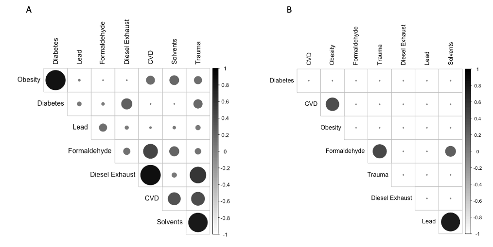

# Flexible approaches for complex settings

In the previous sections we have discussed the challenges that arise when evaluating environmental mixtures and the several available techniques based on regression modeling that can be used to to address different research questions in this context. The final section of section 4 discussed  the 2 major limitations shared by all regression techniques, namely the difficulties in estimating overall mixture effects and to include additional model complexities such as non-linearities and (possibly high-order) interactions. In the previous section we have discussed WQS as a useful tool to address the first limitation. Note than, interestingly, this technique can be actually seen as yet another regression extension, as it is based on integrating a summary score into a generalized linear model.

To tackle the second challenge, let's first note that any regression would allow integrating interactions of any order (this is done by simply including product terms between any pair, or higher combination, of exposures) as well as non-linear associations. Splines modeling is probably the best way of accounting for non-linear effects in regression modeling, and one can also consider using generalized additive models (GAM), which have been successfully applied in the context of environmental mixtures (@zheng2020evaluating). Nevertheless, both the inclusion of product terms and spline transformations will rapidly increase the number of parameters that are to be estimated, and we might be in need of alternative techniques that can more flexibly tackle these issues. In this context, we are going to describe two approaches: first, bayesian kernel machine regression (BKMR), a method directly developed for evaluating environmental mixtures that is increasing in popularity because of its several advantages and flexibility (@bobb2015bayesian),(@bobb2018statistical). Second, the use of machine learning techniques, and specifically tree-based modeling such as boosted regression trees (@lampa2014identification),(@bellavia2021joint). Additional techniques that can be considered when the specific focus is on detecting interactions will not be discussed here, and the reader can refer to these publications summarizing and discussing methodologies in this context: @barrera2017systematic, @sun2013statistical.

## Bayesian Kernel Machine Regression

The material presented in this section is largely taken from Prof. Coull's guest lectures material and Dr. Bobb's [vignette](https://jenfb.github.io/bkmr/overview.html).

### Introduction 

Possible objectives of a mixtures analysis could include detection and estimation of an effect of the overall mixture,
 identification of pollutant or group of pollutants responsible for
observed mixture effects,visualizing the exposure-response function, or
detection of interactions among individual pollutants. Bayesian Kernel Machine Regression (BKMR) is designed to address all
four of these objectives in a flexible non-parametric way. The main idea of BKMR is to model exposure through means of a kernel function. Specifically, the general modeling framework is

$$Y_i=h(z_{i1},…,z_{iM})+βx_i+\epsilon_i$$

where $Y_i$ is a continuous, normally distributed health endpoint, $h$ is a flexible function of the predictor variables $z_{i1},…,z_{iM}$, and $x_i$ is a vector of covariates assumed to have a linear relationship with the outcome

There are several choices for the kernel function used to represent $h$. The focus here is on the Gaussian kernel, which flexibly captures a wide range of underlying functional forms for h and can accommodate nonlinear and non-additive effects of the
multivariate exposure. Specifically, the Gaussian kernel implies the following representation for $h$:

$$K_{vs}(z_i,z_j)=exp\{-\sum_{M}r_m(z_{im}-z_{jm})^2\}$$

Intuitively, the kernel function shrinks the estimated health effects of two individuals with similar exposure profiles toward each other. The weights $r_m$ present the probability that each exposure is important in the function, with $r_m=0$ indicating that there is no association between the $m^{th}$ exposure and the outcome. By allowing some weights to be 0, the method is implicitly embedding a variable selection procedure. This can also integrate information on existing structures among exposures (e.g. correlation clusters, PCA results, similar mechanisms ...) with the so-called hierarchical variable selection, which estimates the probability each group of exposures is important, and the probability that, given a group is important, each
exposure in that group is driving that group-outcome association.

### Estimation


BKMR takes its full name from the Bayesian approach used for estimating the parameters. The advantages of this include the ability of estimating the importance of each variable ($r_m$) simultaneously, estimating uncertainties measures, and easily extending the estimation to longitudinal data. Since the estimation is built within an iterative procedure (MCMC), variable importance are provided in terms of Posterior Inclusion Probability (PIP), the proportion of iterations with $r_m>0$.  Typically, several thousands of iterations are required.

The `bkmr` R package developed by the Authors makes implementation of this technique relatively straightforward. 

Using our illustrative example, the following chunk of code includes a set of lines required before estimating a BKMR model. Specifically, we are defining the object containing the mixture ($X_{1}-X_{14}$), the outcome ($Y$), and the confounders ($Z_1-Z_3$). We also need to generate a seed (we are using an iterative process with a random component) and a knots matrix that will help speeding up the process. This final step is very important as the model estimation can be extremely long (the recommendation is to use a number of knots of more or less n/10).  


```{r import2, include=FALSE}
library(readxl)
library(bkmr)
library(corrplot)
library(ggplot2)   
library(beepr)
data2<- read_excel("C:/Users/AI880/Dropbox/Teaching/Environmental mixtures/2021_EH550/labs/dataset2xls.xls")

#data2 <- read_excel("~/Dropbox/Teaching/Environmental Mixtures/2021_EH550/labs/dataset2xls.xls")

#lnmixture   <- apply(mixture, 2, log)
#lnmixture_z <- scale(lnmixture)
```

```{r import2a}
mixture<-as.matrix(data2[,3:16])
y<-data2$y
covariates<-as.matrix(data2[,17:19])

set.seed(10)
knots100  <- fields::cover.design(mixture, nd = 50)$design

```

The actual estimation of a BKMR model is very simple and requires one line of R code. With the following lines we fit a BKMR model with Gaussian predictive process using 100 knots. We are using 1000 MCMC iterations for the sake of time, but your final analysis should be run on a much larger number of samples, up to 50000. Here we are allowing for variable selection, but not providing any information on grouping. 

```{r models, message=FALSE,warning=FALSE}

temp <-  kmbayes(y=y, Z=mixture, X=covariates, iter=1000, verbose=FALSE, varsel=TRUE, 
                 knots=knots100)

ExtractPIPs(temp)
```


The `ExtractPIPs()` command will show one of the most important results, the posterior inclusion probabilities. We can interpret this output as the variable selection part, in which we get information on the importance of each covariate in defining the exposures-outcome association. In descending order, the most important contribution seem to come from $X_{12}, X_{6}, X_{10}, X_{2}, X_{14}, X_{11}$. This is in agreement with Elastic Net and WQS, which also identified $X_{12}$ and $X_6$ as the important contributors. Also note that within the other cluster we haven't yet been able to understand who the bad actor, if any, is. 

### Trace plots and burning phase

Since we are using several iterations it is important to evaluate the convergence of the parameters. These can be checked by looking at trace plots (what we expect here is some kind of random behaving around a straight line). What we generally observe is an initial phase of burning, which we should remove from the analysis. Here, we are removing the first 100 iterations and this number should be modify depending on the results of your first plots. Here the figures show good convergence.

```{r trace}

sel<-seq(0,1000,by=1)

```
```{r figureenetadjs, fig.cap='Convergence plot for a single parameter without exclusions', out.width='80%', fig.asp=.75, fig.align='center'}
TracePlot(fit = temp, par = "beta", sel=sel)
```


```{r tracedf}
sel<-seq(100,1000,by=1)


```


```{r figureenetadjsd, fig.cap='Convergence plot for a single parameter after burning phase exclusion', out.width='80%', fig.asp=.75, fig.align='center'}
TracePlot(fit = temp, par = "beta", sel=sel)
```

### Visualizing results 

After estimation of a BKMR model, which is relatively straightforward and just requires patience throughout iterations, most of the work will consist of presenting post-estimation figures and functions that can present the complex relationship between the mixture and the outcome. The R package includes several functions to summarize the model output in different ways and to visually display the results.

To visualize the exposure-response functions we need to create different dataframes with the predictions that will be then graphically displayed with `ggpolot`.

```{r univar, message=FALSE, warning=FALSE}
pred.resp.univar <- PredictorResponseUnivar(fit = temp, sel=sel, method="approx")

#pred.resp.bivar  <- PredictorResponseBivar(fit = temp,  min.plot.dist = 1, sel=sel, 
#                                           method="approx")

#pred.resp.bivar.levels <- PredictorResponseBivarLevels(pred.resp.df = pred.resp.bivar, 
#                         Z = mixture, both_pairs = TRUE, qs = c(0.25, 0.5, 0.75))

risks.overall <- OverallRiskSummaries(fit = temp, qs = seq(0.25, 0.75, by = 0.05), 
                                      q.fixed = 0.5, method = "approx",sel=sel)

risks.singvar <- SingVarRiskSummaries(fit = temp, qs.diff = c(0.25, 0.75),
                                    q.fixed = c(0.25, 0.50, 0.75), method = "approx")

risks.int <- SingVarIntSummaries(fit = temp, qs.diff = c(0.25, 0.75),
                                 qs.fixed = c(0.25, 0.75))

```


The first three objects will allow us to examine the predictor-response functions, while the next three objects will calculate a range of summary statistics that highlight specific features of the surface.

#### Univariate dose-responses

One cross section of interest is the univariate relationship between each covariate and the outcome, where all of the other exposures are fixed to a particular percentile. This can be done using the function `PredictorResponseUnivar`. The argument specifying the quantile at which to fix the other exposures is given by `q.fixed` (the default value is `q.fixed = 0.5`).

```{r save, fig.cap='Univariate dose-response associations from BKMR', out.width='80%', fig.asp=.75, fig.align='center',warning=FALSE}


ggplot(pred.resp.univar, aes(z, est, ymin = est - 1.96*se, ymax = est + 1.96*se)) + 
  geom_smooth(stat = "identity") + ylab("h(z)") + facet_wrap(~ variable) 

```

We can conclude from these figures that all selected covariates have weak to moderate associations, and that all dose-responses seem to be linear (maybe leaving some benefit of doubt to $X_6$).

#### Bivariable Exposure-Response Functions

This visualizes the bivariate exposure-response function for two predictors, where all of the other predictors are fixed at a particular percentile.

```{r save2, fig.cap='Bivariate exposure-response associations from BKMR', out.width='80%', fig.asp=.75, fig.align='center', cache=TRUE,warning=FALSE,eval=FALSE}
ggplot(pred.resp.bivar, aes(z1, z2, fill = est)) + 
  geom_raster() + 
  facet_grid(variable2 ~ variable1) +
  scale_fill_gradientn(colours=c("#0000FFFF","#FFFFFFFF","#FF0000FF")) +
  xlab("expos1") +
  ylab("expos2") +
  ggtitle("h(expos1, expos2)")
```

#### Interactions 
The figure we just plotted might not be the most intuitive way of checking for interactions. An alternative approach is to investigate the predictor-response function of a single predictor in Z for the second predictor in Z fixed at various quantiles (and for the remaining predictors fixed to a particular value). These can be obtained using the `PredictorResponseBivarLevels` function, which takes as input the bivariate exposure-response function outputted from the previous command, where the argument `qs` specifies a sequence of quantiles at which to fix the second predictor.  We can easily select a specific combination we want to present, like the X6-X12 one.

```{r save3, cache=TRUE, fig.cap='Qualitative interaction assessment from BKMR', out.width='80%', fig.asp=.75, fig.align='center',eval=FALSE,warning=FALSE}
ggplot(pred.resp.bivar.levels, aes(z1, est)) + 
  geom_smooth(aes(col = quantile), stat = "identity") + 
 facet_grid(variable2 ~ variable1) +
  ggtitle("h(expos1 | quantiles of expos2)") +
 xlab("expos1")


```

```{r save3dsfgsgfd, cache=TRUE, include=FALSE,warning=FALSE,eval=FALSE}
# 6-12
pred.resp.bivar.levels6_12<-pred.resp.bivar.levels[pred.resp.bivar.levels$variable1 =='x6' 
                                                   & pred.resp.bivar.levels$variable2 =='x12', ]

```

```{r save3fdg,eval=FALSE, cache=TRUE,fig.cap='Qualitative interaction assessment between X6 and x12 from BKMR', out.width='80%', fig.asp=.75, fig.align='center',echo=FALSE,warning=FALSE}


ggplot(pred.resp.bivar.levels6_12, aes(z1, est)) + 
 geom_smooth(aes(col = quantile), stat = "identity") + 
 facet_grid(variable2 ~ variable1) +
 ggtitle("h(expos1 | quantiles of expos2)") +
 xlab("expos1")

```


This figures do not provide any evidence of interactions throughout the mixture.

#### Overall Mixture Effect
Another interesting summary plot is the overall effect of the mixture, calculated by comparing the value of $h$ when all of predictors are at a particular percentile as compared to when all of them are at their 50th percentile. The function `OverallRiskSummaries` allows one to specify a sequence of values of quantiles using the argument  `qs ` and the fixed quantile (the default is the 50th percentile) using the argument  `q.fixed `.
 
```{r save4,fig.cap='Overall Mixture Effect from BKMR', out.width='80%', fig.asp=.75, fig.align='center',warning=FALSE}
ggplot(risks.overall, aes(quantile, est, ymin = est - 1.96*sd, ymax = est + 1.96*sd)) +  
  geom_hline(yintercept=00, linetype="dashed", color="gray") + 
  geom_pointrange() + scale_y_continuous(name="estimate") 

```

In agreement with WQS, higher exposure to the overall mixture is associated with higher mean outcome.

#### Single Variables effects

This additional function summarizes the contribution of an individual predictor to the response. For example, we may wish to compare risk when a single predictor in $h$ is at the 75th percentile as compared to when that predictor is at its 25th percentile, where we fix all of the remaining predictors to a particular percentile.

```{r save5,fig.cap='Individual effects from BKMR', out.width='80%', fig.asp=.75, fig.align='center',warning=FALSE}
ggplot(risks.singvar, aes(variable, est, ymin = est - 1.96*sd,  ymax = est + 1.96*sd, 
       col = q.fixed)) + geom_hline(aes(yintercept=0), linetype="dashed", 
       color="gray") +  geom_pointrange(position = position_dodge(width = 0.75)) +
       coord_flip() + theme(legend.position="none")+scale_x_discrete(name="") +
       scale_y_continuous(name="estimate") 

```


#### Single Variable Interaction Terms
Finally, this function is similar to the latest one, but refers to the interaction of a single exposure with all other covariates. It attempts to represent an overall interaction between that exposure and all other components.
```{r save6, fig.cap='Individual interaction effects from BKMR', out.width='80%', fig.asp=.75, fig.align='center',warning=FALSE}
ggplot(risks.int, aes(variable, est, ymin = est - 1.96*sd, ymax = est + 1.96*sd)) + 
  geom_pointrange(position = position_dodge(width = 0.75)) + 
  geom_hline(yintercept = 0, lty = 2, col = "brown") + coord_flip()

```

As we concluded before, this graph also leads us to conclude that we have no evidence of interaction for any covariate (which, as we know from simulated data, is true).

### Hierarchical selection
The variable selection procedure embedded into BKMR can also operate within a hierarchical procedure. Using our example, we could for instance inform the model that there are highly correlated clusters of exposures. This will allow us to get an estimate of the relative importance of each cluster and of each exposure within it. The procedure is implemented as follows, where we are specifically informing the model that there is a cluster of three highly correlated covariates:


```{r model2, message=FALSE, warning=FALSE}

hier <-  kmbayes(y=y, Z=mixture, X=covariates, iter=1000, verbose=FALSE, varsel=TRUE, 
                 knots=knots100, groups=c(1,1,2,2,2,1,1,1,1,1,1,1,1,1))

ExtractPIPs(hier)
```

Group PIPs seem to point out that the cluster is somehow relevant in the dose-response association, and indicates that that $X_4$ might be the most relevant of the three exposures.

### Extensions

The first release of BKMR was only available for evaluating continuous outcomes, but recent work has extended its use to the context of binary outcomes, which are also integrated in the latest versions of the package. @domingo2019association have also described how to apply BKMR with time-to-event outcomes. Additional extensions of the approach that could be of interest in several settings also include a longitudinal version of BKMR based on lagged regression, which can be used to evaluate time-varying mixtures (@liu2018lagged). While this method is not yet implemented in the package, it is important to note that similar results can be achieved by evaluating time-varying effects through hierarchical selection. In brief, multiple measurements of exposures can be included simultaneously in the kernel, grouping exposures by time. An example of this application can be found in @tyagi2021identifying, evaluating exposures to phthalates during pregnancy, measured at different trimester, as they relate to final gestational weight. By providing a measure of group importance, group PIPs can here be interpreted as measures of relative importance of the time-windows of interest, thus allowing a better understanding of the timing of higher susceptibility to mixture exposures. 

Finally, we have described how BKMR can provide a graphical qualitative assessment of interaction. Some additional work is being conducted to formally provide measures of interaction and is briefly presented [here](https://github.com/jantonelli111/NLinteraction). 

### Practical considerations and discussion 

To conclude our presentation of BKMR, let's list some useful considerations that one should take into account when applying this methodology:

- As a Bayesian technique, prior information could be specified on the model parameters. Nevertheless this is not commonly done, and all code presented here is assuming the use of non-informative priors. In general, it is good to remember that PIP values can be sensitive to priors (although relative importance tends to be stable).
- Because of their sensitivity, PIP values can only be interpreted as a relative measure of importance (as ranking the importance of exposures). Several applied papers have been using thresholds (e.g. 0.5) to define a variable "important" but this is interpretation is erroneous and misleading. 
- The BKMR algorithm is more stable when it isn't dealing with exposures on vastly different scales. We typically center and scale both the outcome and the exposures (and continuous confounders). Similarly, we should be wary of exposure outliers, and log-transforming exposures is also recommended.
- BKMR is operating a variable selection procedure. As such, a PIP of 0 will imply that the dose-response for that covariate is a straight line on zero. This does not mean that a given exposure has no effect on the outcome, but simply that it was not selected in the procedure. As a matter of fact, when an exposure has a weak effect on the outcome BKMR will mostly tend to exclude it. As a consequence of this, the overall mixture effect will really present the overall effect of the selected exposures.
- As a Bayesian technique, BKMR is not based on the classical statistical framework on null-hypothesis testing. 95% CI are interpreted as credible intervals, and common discussions on statistical power should be avoided.
- Despite the estimation improvements through the use of knots as previously described, fitting a BKMR model remains time-demanding. In practice, you might be able to fit a BKMR model on a dataset of up to 10.000 individuals (still waiting few hours to get your results). For any large dataset, alternative approaches should be considered.
- BKMR is a flexible non-parametric method that is designed to deal with complex settings with non-linearities and interactions. In standard settings, regression methods could provide a better estimation and an easier interpretation of results. In practical terms, you would never begin your analysis by fitting a BKMR model but only get to it for results validation or if alternative techniques were not sufficiently equipped to deal with your data.

## Assessing interactions

### Tree-based modeling
In settings when one is interested in formally evaluating interactions, unique challenges are involved. First, we already discussed how evaluating several covariates and high-order interactions within a regression framework
will rapidly increase the number of parameters to be estimated, and the
resulting complexity of the model will make classical regression techniques
of little use. Summary and classification approaches like WQS will not be able to provide an estimate of interaction effects, and we have just discussed how BKMR can only provide some qualitative assessment of interactions, and only among those exposures that have passed the selection procedure.  

To account for the complexity of joint effects and high-dimensional interactions, one should consider specific techniques that have been specifically develop to deal with complex and big data. One machine learning (ML) approach that can be useful in the context of interaction analysis, and specifically when evaluating environmental exposures, is the application of boosted regression trees (BRT), BRT is a tree-based modeling technique that can be used to evaluate complex high-dimensional interactions
among several variables, which can be continuous, categorical, or binary. Boosted trees are
designed to improve the performance of classification and regression
trees (CARTs), which partition the data into several disjoint regions
approximating the outcome as constant within these regions. CARTs can
account for complex interactions by conditioning subsequent splits on
previous ones, a feature that is controlled by a “depth” option.
Higher-order depths correspond to accounting for higher-order interactions. In practical terms, this implies that by modifying the depth option of the algorithm we can incorporate an increasingly higher number of interaction orders. How many interactions should be evaluated, together with other parameters of the model, are identified by the machine through cross validation techniques.

Boosted trees improve the predictive performance of a single
CART by combining several weak learners to accurately identify a set of
explanatory variables that are associated with the outcome. The
improved predictive performance, however, will come at the expense of an easy
interpretation. Specifically, the output of a BRT will provide identification
of variable importance, partial dependence plot, and interactions
hierarchy, but will not provide effect estimates for
each variable or interaction as in classical regression. A BRT model will provide the following objects as output:

* Variable importance: this is based on how many times each variable is
involved in a split, capturing its independent predictive power with
respect to the outcome. This measure holds the same interpretation of PIPs in BKMR

* Dependence plots: similarly to the univariate dose-responses in BKMR, these provide a graphical visualization
of the fitted function that presents the associations between one
or more predictors and the outcome.  These plots are especially helpful
with continuous predictors, but let's stress that this technique can be used with any kind of exposures.

* H-statistics: these are the unique measures of interaction relevance, which indicate,
for any pair of predictors, the fraction of variance that is not captured by
the sum of the two fitted response functions. Of importance, the
Depending on the depth of the algorithm, H-statistics can be calculated
for all levels of interactions including 2-way and more. These measures
do not provide a summary of relative importance (i.e. they do not sum
up to 1) but rather indicate a ranking of importance of interactions. 

For more details on boosted trees we refer to previous publications (@lampa2014identification) and [online documentation](http://uc-r.github.io/gbm_regression). 

In this study, parameters in the final
model were selected using a 10-fold cross validation on 75% of the data
(training sample), estimating the model separately among men and
women, and selecting the model with the lowest root mean squared
error (RMSE).


### Interaction screening and regression approaches

Let us stress once more that both BKMR, which provide a qualitative graphical assessment of interactions, and BRT models, which allow estimating H-statistics to rank interactions of different orders, do not provide direct estimates or tests for interactions effects. For this reason, a recommended practice is to use these techniques as interaction screening procedures and employ a 2-steps approach in which selected interactions are then evaluated in a final regression model. As an illustrative example, we used this approach in a recent paper to identify 2-ways interactions between occupational exposures and health factors that we later integrated in a regression models evaluating the effect of this mixture on ALS risk (@bellavia2021joint). 


