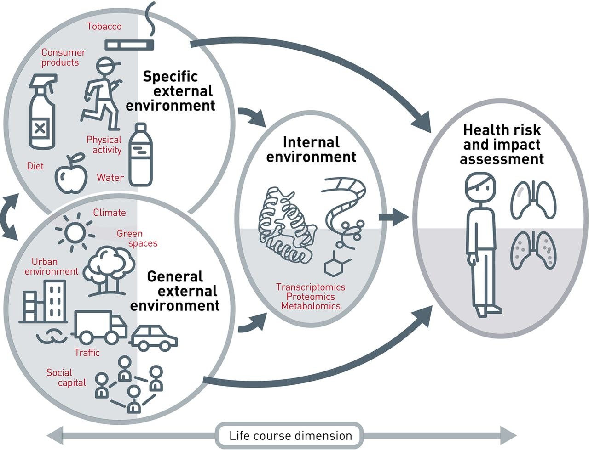
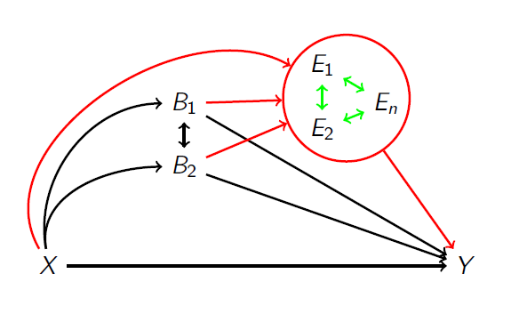

# Additional topics and final remarks

The aim of this last section is to provide a very brief introduction to additional topics that are often of relevance when investigating the health effects of multiple environmental exposures. First, we will provide a general overview of the extent to which what has been discussed so far can be evaluated from a causal inference perspective. Next, we will describe some relatively common situations where additional methodological considerations are required, namely the presence of zero-inflated or binary exposures. Finally, we will present an introductory overview of approaches that allow incorporating multiple exposures in mediation analysis, which is often a primary goal of exposome research.

## Causal mixture effects

To improve our understanding of the associations between environmental exposures and health outcomes, and facilitate the development of more stringent public health regulations and interventions, it is important to determine to which extent these associations reflect causal relationships. To establish causal links, researchers are advocating the use of a pluralistic approach in terms of study design, to reduce the potential harm due to typical epidemiological bias such as confounding or selection bias, as well in terms of statistical methodologies for causal inference (@vandenbroucke2016causality), (@dominici2017best). In the specific case of environmental exposures, this switch from association to causation has  to account for the co-occurrence of multiple components or constituents, present in the real world as a complex mixture. At this time, regulatory policies are still mostly designed to regulate one pollutant or chemical at the time, thus hampering the implementation of integrated policies and possibly resulting in uncertainties about the exact impact of regulations. For this reasons, several researchers, as well as and both governmental and private institutions, are increasingly advocating for more research that could improve our understanding of the causal effects of environmental mixtures evaluated as a complex exposure situation of high-dimensional data.

The first step to improve findings interpretation towards a causal perspective is to focus on study design and pre-analytic considerations. The paper from @dominici2017best provides an excellent introduction that tackles these issues in the context of air pollution epidemiology, but can easily be extended to any set of environmental exposures. Another important contribution in terms of pre-analytic aspects was provided by Weisskopf and Webster (@weisskopf2018bias),(@webster2020epidemiology) who have discussed the issue of bias amplification when evaluating environmental mixtures. Their work directly addresses issues of co-confounding related bias, presenting direct acyclic graphs (DAGs) in different contexts of interest.

After these pre-analytic aspects have been taken into consideration, the focus can be transferred to the statistical approaches that can be used to improve the causal understanding of mixture-outcome associations. Here several points should be mentioned:

* As the exposures mixture gets more and more complex, the time spent on the pre-processing phase (unsupervised analysis) will be more and more important. 
* After this pre-processing phase, the assessment of the mixture-outcome effect should be conducted in two stages. First, by using some of the techniques described here (WQS, BKMR, tree-based methods ...) one can identify a set of exposures (and interactions) that can be included in a  causal model that will later be investigated in a secondary step.
* This 2-stages approach is highly recommended because most of the available methodologies for causal inference are based on extensions of regression techniques (e.g. propensity score, difference in differences, marginal structural models, inverse probability weighting). If the setting is not too complex (i.e. those settings where multiple regression is a potentially good choice), one can directly build the regression-based causal inference technique. A good introduction of causal inference techniques based on regression that can be useful in environmental epidemiology was provided by @bind2019causal.

* Out of the possible methods for causal inference, a versatile option in the context of environmental mixtures is the multivariate version of the generalized propensity score ([mvGPS](https://github.com/williazo/mvGPS)), which we have applied and described in the context of air pollution epidemiology in a recent publication (Traini et al. under review).
* Finally, it is useful to remember that one of the recent extensions of WQS (quantile G-comp) was developed with the aim of improving the causal interpretation of the estimated weights and overall effect and could be used to provide a validation of the cumulative mixture effect from a causal perspective. 

## Binary and zero-inflated exposures

The common setting that we have described so far was making the implicit assumption that we are dealing with a set of multiple continuous exposures (e.g. concentrations of chemicals or pollutants) of joint interest. One important caveat, however, is that continuous exposures evaluated in this context are usually highly skewed (they are strictly non-negative). Log-transformation are commonly used, but these are ineffective where several values are zero. Zero-inflated exposures are skewed covariates with a lot of zeros, typically occurring in environmental epidemiology when several individuals have values below the limit of detection. Removing those individuals from the study (that is, considering this as missing) might reduce power and, most importantly, does not reflect real levels of exposures (it would silence all effects occurring at low levels of exposures). Common alternative options include dicothomization of each exposure into detected/non detected, the use of categorical exposures, or imputation of non-detected values. Even in the latter, however, in the presence of a high number of zeros we would end up getting inflated covariates with a large proportion of individuals with the same exposure value (in practical terms, we might find it hard to really consider the exposure as continuous). If one wants to include zero-inflated covariates in the mixture without any transformation, available techniques include zero inflated poisson models (ZIP), zero-inflated negative binomial models (ZINB), or [hurdle models](https://data.library.virginia.edu/getting-started-with-hurdle-models/).  

When exposures are instead dicothomized (or, in general, when the interest is to evaluate multiple binary exposures), some additional techniques can be considered: 

* First of all, evaluating the crude association between binary exposures, as we presented earlier with the correlation matrix, can be done using the $\phi$ coefficients, with $\phi=\chi^2/n$. 
* Correspondence analysis: This will graphically display all covariates based on their proximity. We can think of this approach as an unsupervised method to investigate and depict patterns of exposures
* Hierarchical models and penalized methods can be used with binary exposures. If all covariates are binary, you may prefer not to standardize in order to improve interpretation.  
* For high dimensional data, extensions of the regression and classification tree approaches for binary data have been developed, both unsupervised and supervised (e.g. CART/MARS, logic regression). BRT can be used with binary exposures.
 

## Mediation analysis 

Mediation analysis is a common approach to investigate causal pathways relating the exposure(s) and the outcome of interest. When evaluating environmental mixtures, there are several settings where our mixture of interest is only a component of an even larger picture.
 For example, we may want to integrate sources of exposures, or evaluate the contribution of environmental chemicals to health disparities. Our mixture, in these cases, is a mediator of a given $X-Y$ association
 In other settings, we might be interested in the mechanisms through which the mixture affects the outcome. The mixture here is the exposure in a mediation model.
We can also have several mixtures affecting each other, or potential causal dependencies within the mixture. 

In the general framework of exposome analysis, the underlying hypothesis is that a set of multiple exogenous exposures (the external exposome) affects the complex set of biomarkers at the microbiome level (the internal exposome), thus contributing to the development of health effects. This structure is explicitly making assumptions in terms of mediation:

The following DAG presents an integrative framework for environmental exposures (E), lifestyle and behavioral factors (B), and social constructs (X), which may be complex but has the potential to elucidate mechanisms through which diseases are caused, which we presented in an introductory publication (@bellavia2018multiple). 

Integrating methods for environmental exposures into mediation analysis has been the goal of several recent papers, which the reader could refer to for further details (@bellavia2019approaches), (@blum2020challenges), (@devick2018bayesian). These methods have been largely unexplored in applied studies and may represent a critical tool to further identify the mechanisms through which the exposome affects human health. A recent R function was also developed to integrate BKMR into a mediation analysis context (@wang2020bkmr).

## Conclusion

The goal of this introductory course was to discuss the challenges involved in the study of environmental mixtures as they relate to health outcomes and introduce the most common statistical approaches that can help addressing some of these challenges. The core points of the discussion were the following: 

* Environmental mixtures represent the way environmental exposures occur and operate in real life and, as such, should be integrated and evaluated in environmental epidemiology studies. This involves a series of analytic and statistical issues that should be carefully addressed and taken into account.

* A first critical classification of statistical methodologies it the one between supervised and unsupervised approaches. It is always recommended to begin the analyses with a thorough pre-processing phase that involves unsupervised techniques. These will help identifying clustering and groupings of exposures, high levels of correlations, missingness, and the presence of inflated covariates, crucially guiding subsequent steps.

* When incorporating the outcome into the picture (supervised approaches) it it always recommended to begin with regression-based approaches. These provide unique advantages and most of the times will provide a good fit to the question of interest.

* Specific methods have been developed to address environmental mixtures when regression techniques are of little use or more flexible approaches are required. This occurs, for example, when high-dimensional interactions are of interests, if most associations are non-linear, or if the primary interest is in retrieving the cumulative mixture effect. Generally, all techniques come with some limitations and it is always recommended to test several methods and validate results providing different perspectives.

* With a very large number of exposures and/or interaction, machine learning (ML) techniques should be considered. Recent extensions of random forests such as gradient boosting machines (or boosted regression trees) provide several advantages in this context. Proceeding with different layers of analysis, using ML results to build a second-step regression model is recommended. 

* Most current methods are available and well documented/presented in the statistical software R.

* In general, when dealing with environmental exposures, the choice of the methods should be drive by the research question of interest.

  + Are there exposure patterns? (unsupervised analysis, e.g. PCA) 
  + What are the effects of individual exposures within the mixture? (regression methods, BKMR)
  + What are the most important contributors to the association? (PIPs in BKMR, weights from WQS, selected covariates in elastic net ...) 
  + What is the overall (cumulative) effect of the mixture? (regression methods, WQS) 
  + Are there interactions (or even synergy) between chemicals? (tree-based modeling, BKMR, regression methods)

Several papers have been presented discussing all these techniques and providing further guidance to choose the correct approach (@hamra2018environmental),(@stafoggia2017statistical),(@gibson2019overview).  Finally, it is useful to remind that the material here presented is just a selection of topics out of a wide and fast-growing research area. Methodological extensions and new applications are continuously published and it is crucial for researchers working in this area to keep up with the literature.

